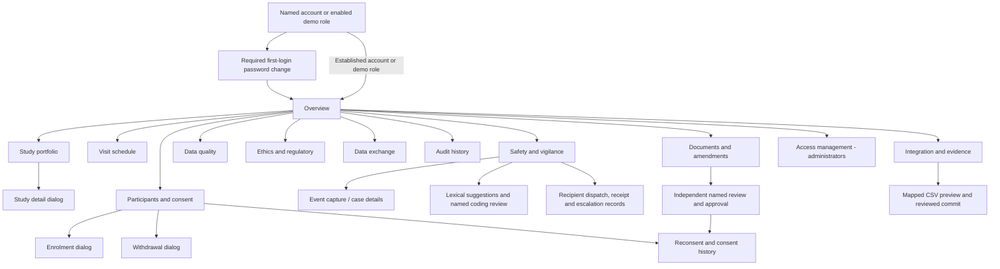

# Anvaya — Product design and interface specification

**Version:** 1.1 · **Date:** 30 September 2026  
**Design status:** implemented responsive browser UI with named access, reviewed evidence, staged imports and safety follow-up; institutional extensions remain explicitly identified.  
**Files:** `public/index.html`, `public/style.css`, `public/app.js`, `public/workflows.js`, `public/safety.js`, `public/favicon.svg`.

## 1. Design direction

Create a calm research workspace that supports careful decisions. The interface should feel closer to an institutional operations tool than a promotional health app. Use a restrained green palette, clear typography, generous spacing and compact tables. Ayurveda identity comes from context and a simple botanical mark, not imagery that implies medical efficacy.

The working name “Anvaya” supports the idea of connection/continuity. It is a provisional product identity, not a registered brand or an AIIA endorsement. Team identity stays separate from product identity.

### Principles

1. **Show the next decision.** An alert names the issue and points to the relevant workspace.
2. **Show the evidence.** Counts derive from records; changes have an inspectable history.
3. **Preserve distinctions.** Seriousness/severity, occurrence/awareness, consent/identity and FHIR/ABDM are not merged for convenience.
4. **Make limits visible where they affect interpretation.** Synthetic labels and export/reporting boundaries appear near the relevant feature.
5. **Keep ordinary operations short.** Use native forms and dialogs; keep implementation detail in About and documentation.
6. **Do not make colour the only signal.** Status chips carry readable text; overdue records carry explicit wording.
7. **Keep human decisions attributable.** Show account identity, review reasons and the evidence version. A named account does not itself establish professional authority.
8. **Expose uncertainty at the decision.** Lexical suggestions may abstain; a recorded dispatch is not a transmission; an imported file is not automatically an accepted participant record.

## 2. Navigation and information hierarchy

Desktop uses a persistent left navigation and a compact top bar. The top bar contains current workspace, search, refresh cadence, alerts, signed-in name/role and sign-out. Named users also receive an Account action for changing their password. The main panel contains heading, context, primary action and the relevant data. Restricted views explain the role boundary; direct API access remains protected independently.

### Sidebar groups

The current navigation keeps sections under one research-workspace label. **Access management** is shown only to administrators. **Documents & amendments** provides scoped records to operational/oversight roles and a restricted view for leadership. **Integration & evidence** is available to all roles; import actions/history, provenance downloads and FHIR checks remain permission-gated. The presence of an informational page never grants its API permissions.

If navigation grows, test grouping Operations, Oversight and Evidence with users before adding a new hierarchy.

## 3. Screen specifications

### Login and required password change

Left: product identity, one concise promise and SIH context. Right: **Named account** and, when enabled by configuration, **Demo roles** modes. Named login asks for username/password; demo mode asks for a role and displays the public demo credential as rehearsal help. The synthetic-data notice identifies fictional studies and distinguishes individual attribution from shared demonstration roles.

Newly provisioned or reset accounts must replace the temporary password before viewing study records. A separate password-change screen requests current/new passwords and provides sign-out. It states that other sessions will be revoked. Password values do not appear in account tables, audit payloads or confirmation messages.

Named users cannot select their own role or assignments at sign-in. Administrators manage those attributes in a separate workflow. Institutional authentication, MFA and identity proofing remain onboarding requirements; locally provisioned identity is not evidence of investigator delegation or clinical authority. Shared demo-role login is optional and should be disabled for institutional operation.

### Access management

The administrator table shows person/username, role, study scope, active/disabled state, password-change requirement and a Manage action. An empty state invites creation of attributable accounts. Creation collects a name, unique username, role, temporary password and explicit assignments. Administrators have all-study scope; other named roles receive only checked studies, including an explicit no-assignment state.

Manage opens current role/scope/status and requires a reason for changes. Separate actions reset the password or revoke sessions. Access, reset and revocation operations carry revision checks; stale forms must be refreshed. Disabling, changing access or resetting an account invalidates existing sessions. The server preserves an active named administrator and prevents self-removal of administrative access through this flow. A success message explains the effect without exposing the password.

The interface records an administrative access decision. Approval of the real person's identity, professional standing and delegated duties remains an institutional process.

### Research overview

Layout order:

1. Page heading and export action.
2. Quiet green summary panel identifying current portfolio and priorities.
3. Four KPI cards: studies, enrolment, due-visit completion and pending initial SAE reports.
4. Recruitment chart with dates and a priority panel.
5. Study table with status, enrolment, site and oversight flag.
6. Synthetic-data and current-role footer.

Each KPI names its unit/denominator. The trend represents cumulative counts from participant dates, not an invented trend line. Leadership uses the same high-level workspace with individual record arrays withheld by the server.

### Study portfolio and drill-down

The portfolio table supports study/status filtering and global search. Clicking a title opens a native modal containing study identity, lifecycle display, enrolment, investigator, site, design, formulation/regimen, batch, protocol, registry and IEC context.

The study dialog shows six explicit readiness checks and their recorded evidence. Administrators can edit Setup metadata and activate recruitment once every check passes. The activation dialog requires review confirmation and a reason. Version conflicts keep the form open with a reload instruction. Active-study changes are handled through **Documents & amendments**, rather than editing the original Setup form.

An expandable **Why these checks matter** section explains prospective registration, recorded IEC validity and current-version consent, with CTRI/ICMR links. Its wording describes participant protection and documented prerequisites without claiming measured AIIA failure rates. The explanation explicitly states that software does not authenticate external approvals. Initial activation checks recorded metadata; the independent file-review workflow governs the implemented amendments. Neither action establishes a validated electronic signature.

### Documents & amendments

The evidence register shows study/kind, version/filename, Submitted/Approved/Rejected state, abbreviated checksum, download and permitted review actions. Upload collects study, Protocol/Consent/IEC kind, version and a PDF or UTF-8 text file up to 512 KiB. File/version identity is immutable through the API; an existing study/kind/version cannot be replaced. Download is scoped; file contents are excluded from list and audit payloads.

A different named reviewer records Approved or Rejected with a reason after inspecting the evidence. The UI explains independence before submission, and the server enforces it even when a review button is visible to the uploader. Review changes metadata, not the original bytes. A rejected version needs a new upload/version; repeating a completed review is blocked.

The amendment section lists study, reason, status and reconsent count, with Inspect and permitted Approve actions. A named administrator or PI submits an active-study change using approved protocol, consent and IEC documents from that study, IEC reference/dates, target and reason. A different named administrator/ethics reviewer approves the current revision. The server rechecks scope, current evidence/readiness and enrolment capacity before applying the change. A consent-version change marks active participants for reconsent; it does not manufacture their consent.

Review labels describe a recorded decision, not an issuer-authenticated approval, an IEC quorum decision or a validated electronic signature. No formal amendment-rejection/withdrawal workflow or full essential-document archive is claimed.

### Participants and consent

Rows prioritise the pseudonym, study and consent status. Prakriti is contextual research data, not a diagnostic badge. Show language and consent version together. Withdrawal is an explicit action requiring a reason; it does not silently delete the person’s history.

The enrolment dialog is sequential: study, adult demographic fields, protocol-defined context, consent version/language and attestation. Server rejection stays in the form, preserving inputs so the user can correct the study or version. The demo’s consent checkbox records operator attestation only.

After an approved consent amendment, rows show **Reconsent due** while retaining the earlier recorded consent version. **Record reconsent** is available to authorised enrolment operators for an active participant. The form displays the current version read-only, collects language, confirmation and evidence/reason, and explains that previous consent stays in history. The **History** dialog shows current recorder/time/version, outstanding reconsent status, previous consent metadata and import provenance where present. Recording reconsent cannot reactivate a withdrawn participant.

### Visit schedule

Display visit, participant, study, scheduled date, status and action. Statuses are Upcoming, Due today, Overdue, Completed and Cancelled. Sort by scheduled date. Future visits cannot be falsely marked completed. Visits cancelled because of withdrawal are excluded from the completion denominator and have no routine completion action.

An outstanding consent amendment or consent-version mismatch removes the routine completion action and displays **Consent action required**. This blocks recording routine research completion while safety capture remains available. It is distinct from withdrawal cancellation: an outstanding reconsent requirement does not itself erase due-visit history or claim a clinical-care restriction.

A future pilot should support approved visit windows, actual visit date distinct from entry time, deviations, missed-visit reasons and rescheduling with original schedule history.

### Safety and vigilance

The inbox separates report identity, verbatim event, classification, initial deadline and analysis deadline. A serious event is visually prominent without conflating seriousness with symptom intensity. The rule label sits beside the clock so users can distinguish NDCT demonstration applicability from an internal SOP target.

The event dialog captures participant, verbatim term, seriousness criterion, severity, occurrence, awareness and narrative. It names local time; the client sends UTC. The case detail dialog shows server receipt separately.

“Record initial” and “Record analysis” retain their external-reference and explanation forms. The case detail now also contains **Dictionary coding** and **Recipient follow-up** sections.

**Dictionary coding.** The case shows verbatim text separately from any selected code, package/kind/release, reviewer and decision time. Earlier coding decisions expand into a history table. Safety/report users can request suggestions from a supplied Synthetic or MedDRA package. Results show up to five code/label pairs and a numeric **Lexical score**, explicitly described as similarity rather than clinical confidence. An empty result displays **Abstained** and leaves the event unchanged. A named user with reporting permission must select and confirm a code with a review reason; no automatic coding or trained NLP claim appears.

Named administrators import packages in **Terminology packages** using a JSON file or a fictional editable sample. The screen shows name, version, kind, term count, importer/time, checksum and licence declaration status. Existing releases cannot be overwritten. MedDRA/WHODrug packages require declared institutional permission; the application does not verify the licence. No licensed terms are bundled. WHODrug packages are labelled product dictionaries and excluded from AE suggestions/coding.

**Recipient follow-up.** Reporting users add a recipient, phase, responsible named account, due time and rule/SOP basis. The assignee selector includes only active reporting users assigned to the event's study. Available event deadlines prefill the form, but copy requires confirming each recipient's actual requirement. The table shows owner/deadline, Awaiting dispatch/Awaiting receipt/Acknowledged status and overdue text. Permitted actions record dispatch, receipt or escalation; they do not send messages.

Dispatch and receipt forms name local-time fields and collect external reference/reason. The evidence details preserve claimed external timestamps separately from when and by whom they were entered. Chronology errors, future completed-event timestamps and repeated dispatch/receipt are rejected. Escalations append timestamped explanations without changing the pending status; acknowledged obligations cannot be escalated. This is manual evidence tracking, not verified delivery or a complete executable legal rulebook. Supporting receipt attachments and automated approved transport remain extensions.

### Data quality

A compact query table shows the study, field, request, age and state. “Resolve” opens an explanation form. Resolved records remain visible. The user does not overwrite or erase the original query. A pilot should add response/reopen/review transitions and independent closure where the SOP requires it.

### Ethics and regulatory

Show the study, registry reference/date, IEC expiry, separate protocol and consent versions, readiness score and a Review action. A missing registry entry uses “Pending · enrolment locked”. The page explains the implemented activation gates. Threshold settings belong to the administrator and must not suggest that statutory safety clocks are editable preferences.

### Data exchange

Three export cards identify payload, format and purpose: FHIR research JSON, DM preview CSV and AE preview CSV. **Check FHIR links** displays implemented resource/reference checks and their limited scope. The page separates these working functions from ABDM/EDC partner acceptance and full submission work. Users without permission see the permission boundary instead of an enabled download/check button. Official validation evidence, if available for a particular export, belongs in the dated validation record rather than being inferred from the UI's local check.

### Integration & evidence

The page opens with the clinical purpose of documented registration, current ethics evidence and applicable consent. An implemented flow strip reads **Source CSV → Mapped preview → Row checks → Human review → Workflow gates → Records + audit**. Four explanatory cards distinguish delivered behaviour and acceptance requirements for hospital/EDC connectivity, SDTM preparation, cloud/recovery and terminology review. References open official sources without claiming live partner connections or trained AI.

Administrator, PI and coordinator roles receive **Import synthetic CSV**. The dialog selects a study and source name, accepts a small CSV or pasted content, exposes optional explicit field-mapping JSON and requires synthetic-data confirmation. Preview creates a staged batch, not participant records. Review shows file checksum, external IDs, row findings and any previous participant outcome. Rejected rows block commit; users correct the source and preview again. A valid preview requires a review confirmation and reason before the existing enrolment operation rechecks current readiness, consent and capacity transactionally.

The history table shows source/study, Preview/Committed state, total/rejected/duplicate counts and creation time. Its Inspect action opens row outcomes. Same-source retries preserve existing results; changed contents under an existing source identity become conflicts. Import history is restricted to import-enabled roles. Export-enabled roles can download scoped provenance; this does not grant access to import mutation controls. Leadership can read the integration explanation without receiving participant batches, document evidence or recipient case records.

The partner design explicitly requires one authorised interface, supported OAuth/SMART or other agreed authentication, versioned mapping and reconciliation before domain commands. It does not display a green “connected” state for an unconfigured EDC, HIS, CTRI or ABDM service.

### Audit and integrity

Show sequence/time, actor, action, entity/reason and abbreviated digest. Expand a row to inspect before/after JSON. “Verify chain” shows a result and event count. The explanation uses “hash linkage” and “tamper evidence”; it does not imply a full independent immutability guarantee.

## 4. Design tokens

| Token | Value | Use |
|---|---|---|
| Ink | `#233B35` | Main text |
| Deep green | `#163C35` | Primary action, identity, login panel |
| Green | `#29644F` | Interactive accents |
| Lime | `#D7EEA5` | Restrained identity accent on dark background |
| Paper | `#F5F7F4` | Workspace background |
| White | `#FFFFFF` | Data cards and forms |
| Divider | `#E6EBE6` | Quiet separation |
| Muted | `#7A8983` | Secondary context; contrast must be reviewed for final usage |
| Danger | `#B64D42` | Overdue/safety attention, accompanied by text |
| Amber | `#A7772F` | Approaching dates and pending work |
| Card radius | 15px | Main containers |
| Control radius | 8–9px | Buttons and inputs |
| Sidebar | 224px desktop, 195px intermediate | Persistent navigation |
| Workspace padding | 34px desktop, 16px mobile | Consistent content edge |

Fonts use the platform system stack; the app downloads no fonts. Desktop heading is approximately 29px, card heading 16px, body 13px, table content around 11px. On dense displays, the pilot should offer larger type or density control after user testing. Small metadata and muted colours have not been certified to WCAG AA.

## 5. Components and interaction contracts

| Component | Contract |
|---|---|
| KPI card | Label, value, unit/denominator and short explanation |
| Status chip | Text + colour; never colour alone |
| Alert | Issue, record/context, urgency and destination |
| Progress bar | Numeric current/target and percentage remain visible |
| Table | Explicit headers, horizontal containment, readable empty state |
| Dialog | Named title, context, labelled fields, inline error, cancel and submit |
| Toast | Confirms a completed action; does not replace important field errors |
| Role badge | Names active role continuously |
| Named account badge | Shows signed-in name/role without implying verified clinical delegation |
| Assignment control | Explicit study selection; all-study scope only for administrators |
| Evidence row | Study, kind, version, review state, checksum and permission-checked download |
| Independent review form | Evidence context, decision/reason and different named reviewer requirement |
| Consent history | Current metadata, earlier versions, reconsent status and source provenance |
| Import preview | Source identity/checksum, row findings, duplicates/conflicts and explicit reviewed commit |
| Coding candidate | Code, label and lexical similarity; human selection and abstention remain visible |
| Recipient obligation | Owner, phase, deadline basis, pending state and distinct external/entry timestamps |
| Export card | States format and validation boundary before download |
| Audit row | Enough context to find the record; detailed payload available on expansion |

Submit controls are disabled while the request is pending. Escape closes the native dialog. The dialog receives modal focus behaviour from the browser. Input errors preserve the form. A successful write closes the dialog and refreshes current data.

## 6. States and recovery

| State | Required presentation |
|---|---|
| Initial load | Plain loading message; no fabricated values |
| Auth required | Return to named login or enabled demo-role choice |
| Temporary password | Require password replacement before study access; keep sign-out available |
| Empty search/filter | Explain no matching records; retain controls |
| Permission denied | Explain the role boundary; avoid pretending a hidden control secures the endpoint |
| Validation failure | Specific inline correction message |
| Conflict | Explain stale revision, immutable version, duplicate source/reporting step, closed query or blocked study state |
| Named identity required | Explain why shared demo identity cannot approve evidence or final coding |
| Independent reviewer required | Preserve the evidence; instruct sign-in by another authorised reviewer |
| Reconsent outstanding | Retain prior consent and offer the current-version recording action to an authorised operator |
| Terminology abstention | Keep original event unchanged; route to review without an invented code |
| Import rejection | Show row findings and require corrected source preview before commit |
| Network interruption | Show a banner and label that the last fetched data remains visible |
| Save success | Short confirmation and refreshed records |
| Session switch | Discard old in-flight snapshot/audit responses |
| Zero denominator | Show unavailable/—, not an invented 100% |

Polling runs every ten seconds while the document is visible. Avoid replacing a view while the user types, uses a select, has an open dialog or expands an audit row. This is a near-real-time demo refresh policy, not a push subscription guarantee.

## 7. Responsive and accessibility requirements

- Desktop: full sidebar, four KPI columns and two main content columns.
- Medium width: narrower sidebar, two KPI columns and stacked chart/alerts.
- Mobile: hidden drawer opened by a labelled menu button, stacked content and internally scrollable tables.
- Keep page-level horizontal overflow absent; data tables may scroll within their container.
- All form controls have visible labels. Icon-only actions have accessible names.
- Provide skip-to-content, semantic headings, visible keyboard focus and native controls.
- Status is communicated in text, and toast announcements use a live region.
- Respect reduced-motion preference.
- Before pilot, test with keyboard-only operation, screen reader, 200% zoom, contrast tooling and actual clinical users. Passing the current mobile check is not a comprehensive accessibility certification.

## 8. Content and terminology

Use “participant” in UI and retain exact standard field names in exports. Use **Record dispatch**, **Record receipt** and **Record escalation** with explicit external-activity wording; none means “send to CDSCO”. Use “mapping preview” instead of “submission-ready”, and **lexical similarity** instead of “AI confidence”. Use “synthetic” consistently on login, dashboard, imports and example terminology packages.

For consent, avoid implying that staff attestation is the participant’s electronic signature. For regulatory review, distinguish committee registration from study approval. For safety, never label a record “caused by” a treatment without an authorised causality assessment.

Use **named account** for implemented individual attribution and reserve **verified institutional identity**, **delegated investigator** and **validated electronic signature** for evidence that the current application does not establish. Keep source authenticity, licence declaration and software checks distinct.

## 9. Screen evidence and presentation use

- [Login](screenshots/01-login.png)
- [Overview](screenshots/02-overview.png)
- [Safety inbox](screenshots/03-safety.png)
- [Mobile view](screenshots/04-mobile.png)
- [Study readiness and clinical rationale](screenshots/05-study-readiness.png)
- [Access management](screenshots/06-access-management.png)
- [Documents and amendments](screenshots/07-documents-amendments.png)
- [Integration and evidence](screenshots/08-integration-evidence.png)
- [Integration mobile view](screenshots/09-integration-mobile.png)
- [Reviewed coding and recipient follow-up](screenshots/10-coding-followup.png)

Screenshots are captured from actual Chrome workflow checks using isolated synthetic databases, including the new account, document, integration and safety screens. They show implemented browser behaviour, not AI-generated mockups or an AIIA production system. Exact dates/counts may differ after subsequent actions. [VALIDATION.md](VALIDATION.md) records the verified scope; browser checks are not clinical, usability or accessibility certification.

## 10. Pilot design validation tasks

Ask a coordinator to enrol in a blocked study and explain the rejection. Ask a PV officer to identify the correct pending deadline without a facilitator. Ask an IEC reviewer to identify the actual approval context. Ask a monitor to reconstruct a query change. Ask leadership to identify its highest-priority study without opening participant data.

Extend tasks to an administrator assigning a named account, an independent reviewer rejecting their own approval attempt, a coordinator recording reconsent while preserving history, an import operator reconciling a duplicate/conflict and a PV user handling terminology abstention. Ask the user to distinguish lexical similarity from clinical confidence and manual receipt recording from externally verified delivery.

Record success, completion time, misinterpretations and any need for help. Pay particular attention to false assumptions: “the app already sent the report”, “Prakriti is a diagnosis”, “the registry number was verified” and “export means certified interoperability”. Revise copy and interaction before adding features.
