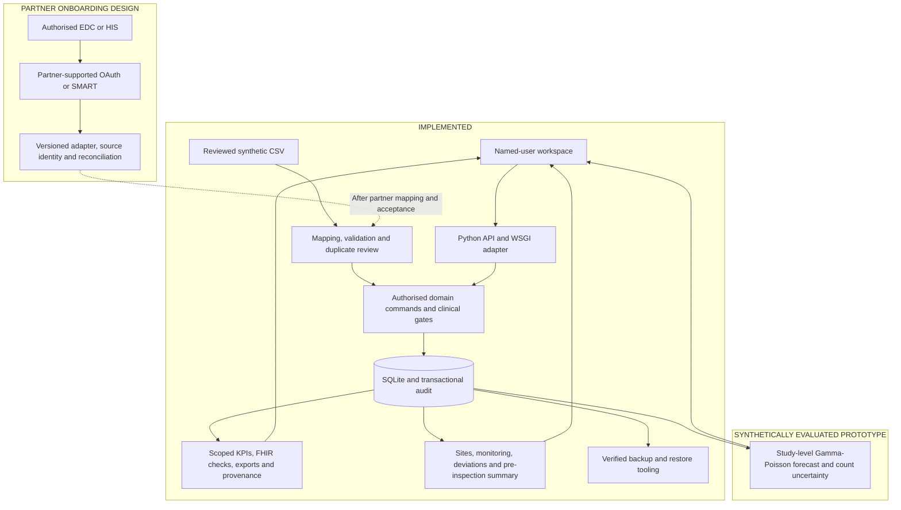

# ANVAYA — built and tested: presentation content

**Updated:** 1 October 2026. **Problem statement:** SIH 26046. **Deliverable:** six slides of editable content, followed by speaker notes.

## Use this content with the supplied layouts

The slide copy presents **what we have built, implemented and tested**. The five supplied layouts correspond to slides 2–6; slide 1 provides cover text. Keep their box positions, colours and visual hierarchy. Replace the example team's name and logo with your own details. Paste only the six slide sections into PowerPoint; the remaining sections are presenter notes.

The architecture and claims match the application and its account, document, exchange and safety modules. Use the [validation record](VALIDATION.md) for documented integration and browser checks and their current results; do not substitute an old test count. [Production gap analysis](PRODUCTION_GAP_ANALYSIS.md) explains the clinical rationale and acceptance requirements for institutional hosting, full submissions, partner interfaces and licensed terminology. The slide copy presents completed software functions; the architecture separately labels partner onboarding design.

**Links and visual assets**

- **GitHub:** [View repository](https://github.com/OMGP1/Anvyaya_2026). Preserve the repository spelling.
- **UI Demo:** `[PUBLIC_UI_URL]` — replace with the reachable preview address before submission.
- **Screenshots:** [overview](screenshots/02-overview.png), [documents](screenshots/07-documents-amendments.png), [integration](screenshots/08-integration-evidence.png), [coding](screenshots/10-coding-followup.png), [mobile](screenshots/09-integration-mobile.png).
- **Video:** include a link only if a walkthrough has been uploaded and opens for reviewers.

Reference labels S1–S12, L1–L3, R1 and V1 are local to this deck. Slide 6 gives their links. Sources establish requirements or design context; implementation files and tests establish what Anvaya does. The [master strategy review](MASTER_STRATEGY_REVIEW.md) records delivered upgrades and the remaining acceptance gates. The forecast is a running, synthetically evaluated prototype; external connections and institutional approval remain separate.

---

## Slide 1 — title and problem identification

**ANVAYA**  
**Connected Clinical Research for Ayurveda**

A working clinical research workspace connecting reviewed evidence, participant consent, safety follow-up and traceable research data.

- **Problem statement:** 26046 — AIIA Clinical Trials Dashboard
- **Organisation:** Ministry of Ayush
- **Department:** All India Institute of Ayurveda
- **Category / Theme:** Software · MedTech / BioTech / HealthTech
- **Team:** [TEAM_NAME] · [TEAM_ID] · [COLLEGE]

**UI Demo:** `[PUBLIC_UI_URL]` · **GitHub:** [View repository](https://github.com/OMGP1/Anvyaya_2026)

**Footer:** Working product demonstration · All study and participant data are synthetic

---

## Slide 2 — ANVAYA: solution overview

**Subtitle:** One Workspace for Ayurveda Study Operations, Participant Consent and Safety Oversight

### Upper left — ABSTRACT

**We have built ANVAYA**, a clinical research workspace connecting Ayurveda study operations with participant protection and reviewable evidence. Registration, current IEC approval and consent checks guard recruitment; reviewed amendments preserve document and consent history. Named accounts enforce study assignments. AE/SAE workflows retain original narratives, support reviewer-controlled terminology selection and track recipient follow-up. Reviewed CSV imports, FHIR research exports and a verifiable audit chain connect the same records across the workspace. Formulation, batch and Prakriti retain Ayurveda context. All demonstration records are synthetic.

### Lower left — CHALLENGES ADDRESSED

- **Prospective research oversight:** Check recorded registration before recruitment begins. [S4]
- **Participant choice:** Require applicable consent and record reconsent after a consent amendment. [S2, S3]
- **Current ethics evidence:** Review approval documents and validity before controlled transitions. [S2, S3]
- **Safety accountability:** Separate event timing, clinical review and recipient follow-up. [L1]
- **Connected research evidence:** Retain Ayurveda context, source provenance and change history. [S1, S8]

### Upper right — UNIQUE VALUE PROPOSITIONS

**Blue box — Ayurveda context in the workflow**  
Study formulation, configured batch and Prakriti remain visible beside study-level safety counts.

**Red box — Readiness and reviewed amendments**  
Readiness checks, independent document review and consent-version gates make missing evidence actionable.

**Purple box — Attributable review**  
Named users, independent approvals, consent history and audit hashes preserve who changed what and why.

**Green box — Actionable operational oversight**  
Site monitoring, deviations and alert rules share one workspace, with a working enrolment forecast and visible uncertainty.

### Lower right — SOLUTION DELIVERED

**UI Demo:** `[PUBLIC_UI_URL]` · **GitHub:** [View repository](https://github.com/OMGP1/Anvyaya_2026) · **Preview:** embed the overview screenshot

1. **Study and evidence:** Six readiness checks, versioned documents, independent review and active-study amendments.
2. **Study operations:** Sites, consent-checked enrolment, monitoring visits, deviations, queries and reconsent.
3. **Safety workspace:** Conditional clocks, reviewed lexical coding suggestions and recorded dispatch/receipt follow-up.
4. **Individual access:** Named accounts, eight roles, managed study assignments, password reset and session revocation.
5. **Integration and exchange:** Reviewed CSV staging, duplicate protection, provenance, local FHIR checks and base-R4-tested exports.
6. **Oversight and integrity:** Configurable alerts, synthetic forecast evaluation, HTML pre-inspection reports and verifiable audit history.

**Footer:** Implemented workflows · Synthetic data · Documented integration and browser checks [V1]

---

## Slide 3 — TECHNICAL APPROACH

### Left panel — Implemented Technology Stack & Methodology

Place boxes 1–5 down the left column and 6–10 up the adjacent column, following the template's connected path.

1. **Browser Data Capture**  
   HTML/CSS/JavaScript connects study, evidence, consent and safety screens.

2. **Named Identity & Scope**  
   Hashed passwords, protected sessions and study assignments govern actions.

3. **Reviewed Evidence**  
   Immutable file versions, independent approval and revision checks govern amendments.

4. **Clinical Workflow Gates**  
   Readiness governs activation and enrolment; current consent governs routine visits.

5. **Governed CSV Ingestion**  
   Mapping, preview, row validation and duplicate checks precede enrolment commands.

6. **Safety Review**  
   Conditional clocks, dictionary candidate matching and named approval retain original text.

7. **Recipient Follow-up**  
   Assigned obligations record external dispatch, receipt and escalation independently.

8. **Transactions & Audit**  
   SQLite saves records with SHA-256-linked audit events; verified backups preserve recovery evidence.

9. **Research Exchange**  
   FHIR resource/link checks, research JSON, DM/AE previews and provenance downloads.

10. **Serving & Operations**  
    Sites, monitoring, deviations and alert rules; Waitress WSGI and HTTPS configuration.

### Upper right — Architecture: Implemented Core + Partner Onboarding Design

Redraw these boxes and connections in the architecture panel.

**Implemented strip:** Browser + Python + SQLite · Optional Waitress WSGI serving · HTTPS configuration and recovery tooling

**Partner design strip:** One authorised source → supported authentication → staged mapping/reconciliation → existing domain commands

### Lower right — Verification Evidence

**Clinical workflow checks**  
Readiness, independent amendments, current consent and withdrawal guards are exercised.

**Identity and history checks**  
Named permissions, study scope, revocation, stale edits and audit integrity are exercised.

**Data and recovery checks**  
Import reconciliation, site linkage, monitoring chronology, deviation closure and backup/restore have explicit checks.

**Demonstration evidence**  
Documented integration and browser checks identify tested workflows and current results. [V1]

**Footer:** Implemented stack and functional evidence · [Repository](https://github.com/OMGP1/Anvyaya_2026)

---

## Slide 4 — FEASIBILITY AND VIABILITY

### Upper left — Technical Feasibility

| CHALLENGES | IMPLEMENTED TECHNICAL SOLUTION |
|---|---|
| **Protecting clinical record consistency** | Shared domain checks, reviewed amendments and transactional audit writes; production release requires institution-approved SOP validation. |
| **Operating a secure institutional service** | Named access, WSGI/HTTPS configuration and verified backup tools; hosting, MFA, security review and recovery targets form acceptance gates. |
| **Exchanging trustworthy research data** | CSV staging, provenance and local FHIR checks; live partners and submission packages require agreed mappings and external acceptance. |

### Upper right — Strategies & Algorithms

- **Clinical rules:** Shared readiness and consent checks remain active when imported rows enter domain commands.
- **Source reconciliation:** Explicit mappings, content hashes and source identifiers detect duplicate or conflicting rows.
- **Reviewed terminology:** Deterministic lexical similarity ranks supplied terms; low matches abstain and named reviewers select codes.
- **Explainable forecast:** Gamma–Poisson target probability and nominal 90% enrolment-count range, checked against a trailing-rate baseline on 300 synthetic studies. [R1, V1]
- **Integrity and follow-up:** Hash-linked audit evidence, chronological reporting records and verified backup copies support review.

### Lower left — Operational Feasibility

1. **Delivered operating base:** Named access, deployment configuration, persistent records and backup/restore tooling.
2. **Institutional acceptance:** Approve hosting, privacy responsibilities, retention, MFA, incident ownership and measured recovery.
3. **One partner at a time:** Validate an authorised EDC/HIS interface, source mapping, safe retries and reconciliation before expansion.
4. **Governed standards release:** Obtain dictionary rights; approve SDTM mappings, transport, Define-XML and recipient validation.

**Proof strip:** 69 automated test methods + 3 Chrome workflows passed · 300-study synthetic forecast evaluation · Production acceptance path defined [V1]

### Lower right — Capability Comparison

| REVIEW NEED | SEPARATE FILES / REGISTRY RECORD | ANVAYA'S IMPLEMENTED RESPONSE |
|---|---|---|
| **Study and consent evidence** | Versions and decisions require manual reconciliation | Reviewed documents, amendment history and participant reconsent |
| **Incoming research records** | Repeated files can duplicate or overwrite work | Staged mapping, source hashes, duplicate checks and provenance |
| **Safety follow-up** | Narrative, coding and recipient records may be separate | Preserved verbatim text, reviewed coding and assigned receipt tracking |

**Footer:** Demonstrate the same saved records through the workspace, exports and audit history

---

## Slide 5 — IMPACT AND BENEFITS

### Left heading — IMPACTS ON TARGET AUDIENCE

**Upper box — AIIA Study Teams**

- **Investigators and coordinators:** Inspect enrolment, consent, due visits and unresolved queries together.
- **Ethics and PV users:** Independently review evidence, terminology selections and recipient follow-up.
- **Monitors and reviewers:** Schedule monitoring, record findings, close deviations and inspect scoped pre-inspection reports.

**Lower box — Institutional Research**

- **Leadership visibility:** Portfolio and safety summaries exclude individual participant and case arrays.
- **Ayurveda context:** Formulation, batch, intervention type and Prakriti stay visible with the relevant records.
- **Reviewable data:** Linked research JSON and CSV mapping previews support downstream inspection.

### Upper right, blue box — SOCIAL

**Participant choice:** Current-consent checks, amendment-triggered reconsent and withdrawal guards protect documented participation choices.

**Visible safety work:** Original narratives, named review and assigned follow-up keep pending actions inspectable.

### Upper right, red box — ECONOMIC

**Controlled operating costs:** The local workflow uses Python and SQLite without paid API calls; institutional hosting and licences are budgeted separately.

**Reusable records:** KPIs, downloads and audit views read the same stored data for operational review.

### Lower right heading — BENEFITS OF SOLUTION

**Purple box — GOVERNANCE**

**Controlled actions:** Role permissions and study assignments determine who can view or change records.

**Traceable changes:** Audit entries retain named-account attribution, timestamps, reasons and applicable before/after values.

**Green box — ENVIRONMENTAL**

**Electronic workflow:** Study forms, review screens and record history are available digitally.

**Shareable outputs:** JSON and CSV files support electronic review without requiring printed reports.

**Footer:** Demonstrated benefits: connected visibility, enforced checks, persistent records and inspectable history

---

## Slide 6 — RESEARCH AND REFERENCES

Use the template's four reference boxes. Hyperlink the source titles; keep long URLs out of visible slide text.

### Upper left — Clinical Research & Ayurveda Context

1. **[S1] Problem definition:** [SIH 2026 — PS 26046](https://sih.gov.in/sih2026PS).
2. **[S2] ASU conduct and product context:** [GCP-ASU Guidelines — Ministry of AYUSH / CCRAS](https://ccras.nic.in/wp-content/uploads/2025/09/3.-ASU-GCP-Guidelines.pdf).
3. **[S3] Ethics and informed consent:** [ICMR National Ethical Guidelines](https://ethics.ncdirindia.org/icmr_ethical_guidelines.aspx).
4. **[S4] Prospective registration:** [CTRI — Official FAQ](https://ctri.nic.in/Clinicaltrials/faq.php).

### Lower left — Research Data & Exchange

1. **[S5] Research exchange:** [FHIR R4 ResearchStudy](https://hl7.org/fhir/R4/researchstudy.html), [ResearchSubject](https://hl7.org/fhir/R4/researchsubject.html), [Consent](https://hl7.org/fhir/R4/consent.html) and [REST interface](https://hl7.org/fhir/R4/http.html).
2. **[S6] ABDM exchange profiles:** [NRCeS ABDM FHIR Implementation Guide](https://nrces.in/ndhm/fhir/r4/).
3. **[S7] Research standards:** [CDASH](https://www.cdisc.org/standards/foundational/cdash), [SDTMIG 3.4](https://www.cdisc.org/standards/foundational/sdtmig/sdtmig-v3-4), [ADaM](https://www.cdisc.org/standards/foundational/adam) and [Define-XML](https://www.cdisc.org/standards/data-exchange/define-xml).
4. **[S12] Submission validation:** [CDISC CORE](https://www.cdisc.org/core) and [FDA Technical Conformance Guide, June 2026](https://www.fda.gov/media/153632/download). Recipient applicability must be established.

### Upper right — Safety, Ethics & Integrity

1. **[L1] Conditional safety-rule basis:** [CDSCO — NDCT Rules 2019 and amendments](https://www.cdsco.gov.in/opencms/opencms/en/Acts-and-rules/New-Drugs/).
2. **[S8] Integrity design reference:** [MHRA — GxP Data Integrity Guidance](https://www.gov.uk/government/publications/guidance-on-gxp-data-integrity).
3. **[L2] Phased privacy framework:** [DPDP Act](https://www.meity.gov.in/static/uploads/2024/06/2bf1f0e9f04e6fb4f8fef35e82c42aa5.pdf), [commencement notification](https://www.meity.gov.in/static/uploads/2025/11/c56ceae6c383460ca69577428d36828b.pdf) and [final Rules 2025](https://www.meity.gov.in/static/uploads/2025/11/53450e6e5dc0bfa85ebd78686cadad39.pdf).
4. **[L3] Operational security context:** [CERT-In Directions, 28 April 2022](https://www.cert-in.org.in/PDF/CERT-In_Directions_70B_28.04.2022.pdf).

### Lower right — Engineering & Implementation Evidence

1. **[S9] Serving and persistence:** [Waitress documentation](https://docs.pylonsproject.org/projects/waitress/en/stable/) and [Python SQLite interface](https://docs.python.org/3/library/sqlite3.html).
2. **[S10] Partner authentication design:** [OAuth 2.0 client credentials](https://www.rfc-editor.org/rfc/rfc6749#section-4.4) and [SMART Backend Services](https://hl7.org/fhir/smart-app-launch/backend-services.html).
3. **[S11] Terminology governance:** [MedDRA term-selection guidance](https://files.meddra.org/www/Website%20Files/PtCs/001329_termselptc_r4_26_mar2026%20%281%29.html) and [UMC WHODrug Global](https://who-umc.org/whodrug/whodrug-global/what-is-whodrug-global/).
4. **[V1] Implementation evidence:** [GitHub repository](https://github.com/OMGP1/Anvyaya_2026) · [Validation record](VALIDATION.md) · UI: `[PUBLIC_UI_URL]`.
5. **[R1] Recruitment modelling:** [Time-dependent Poisson–Gamma research](https://arxiv.org/abs/2301.03710) · [Our synthetic evaluation](validation/forecast-evaluation.json). Our model is a simpler study-level prototype.

**Footer:** Development data: generated synthetic studies and participants · Official sources: requirements and standards references

---

## Speaker notes — keep off the slides

### Slide 1 — approximately 20 seconds

“We have built Anvaya for the AIIA clinical-trials dashboard problem. It connects reviewed study evidence, individual access, participant consent, safety follow-up and research data. The same saved records drive the browser, exports and audit entries. We demonstrate these completed software workflows using synthetic data.”

### Slide 2 — approximately 50 seconds

“The clinical reason for the gates is specific. Registration records the study before recruitment; current IEC approval establishes the recorded ethics basis; applicable consent documents the participant's choice. Anvaya checks those records at the point of action. It also preserves versions when a study changes and requires reconsent when its consent version changes. Staff must still verify the genuine approval and conduct the consent process. A form checkbox cannot prove understanding or replace an IEC decision.”

“These controls follow documented trial-conduct requirements. We have not measured AIIA failure rates or claimed that Ayush studies routinely violate them. Formulation, batch and Prakriti remain available alongside the study. Safety reporting remains available after withdrawal; stopping a routine research action must not be presented as denying clinical care.”

“Named local accounts now carry individual identifiers and managed study assignments. Administrators can reset passwords and revoke sessions. Shared role login is a separate local demonstration mode; document approvals, amendments and final terminology review require named accounts. Institutional SSO/MFA and verification of the real account holder remain onboarding controls.”

### Slide 3 — approximately 60 seconds

“The implemented core uses HTML, CSS, JavaScript, Python and SQLite. The local demo uses the standard library; the deployment path adds a WSGI adapter, pinned Waitress and an HTTPS reverse-proxy configuration. Creating that configuration does not establish a public deployment. Clinical operations and their audit entries share a transaction.”

“Incoming synthetic CSV records are mapped and staged for review. Invalid rows and conflicting source IDs are rejected; safe retries retain the earlier outcome. Commit uses the same enrolment operation as the UI, so an import cannot skip current study or consent gates. Source and row hashes, external IDs and import IDs remain available as provenance. The delivered connector is this bounded CSV workflow; it does not silently merge hospital patient identities or update existing clinical records.”

“The second architecture strip is partner onboarding design. One authorised EDC/HIS adapter obtains data through the partner's documented interface. OAuth client credentials or SMART Backend Services applies only when that partner supports it. The adapter records source version and receipt metadata, validates the agreed schema, stages conflicts and sends approved changes through existing domain commands. Credentials alone never establish permission to use a person's data for research.”

“The workspace checks the generated research collection, resource identities and internal references. Separately, the official HL7 validator checked 306 synthetic resources against base R4: zero errors, 100 consent-policy warnings and 100 notices because terminology-service checks were disabled. The report preserves these findings. ABDM's clinical DocumentBundle, consent exchange and HIP/HIU onboarding require separate mapping and sandbox work.”

### Slide 4 — approximately 50 seconds

“Feasibility is supported by a delivered operating base and specific acceptance gates. We have individual accounts, reviewed records, import controls, a WSGI serving option and verified recovery tooling. The current functional verification includes 69 automated test methods and three Chrome workflows. Operations adds sites, monitoring, deviations, query creation, visible thresholds and an HTML pre-inspection report. The dated validation record distinguishes these checks from earlier container verification. Institutional operation still needs approved hosting, identity federation where required, a retention schedule, security assessment, measured recovery and an accountable operating team.”

“The forecast is running and evaluated on 300 synthetic studies. With a constant rate, its nominal 90% interval covers 91.33% of outcomes in the simulation. After an unforeseen 50% slowdown, coverage falls to 24%. The point forecast performs similarly to the trailing-rate baseline. We show these limits because an operational estimate must expose its assumptions. It is not a clinically validated predictor, a dropout model or evidence of improved recruitment.”

“A PostgreSQL migration is justified by agreed concurrency and availability needs, not by presentation terminology. Its acceptance should reconcile identifiers, document checksums and unchanged audit payload bytes, exercise failed transactions and rehearse rollback. Our comparison describes connected behaviour relative to separate files. It does not imply that established CTMS or EDC products lack audit or access controls.”

### Slide 5 — approximately 45 seconds

“The demonstrated benefits are connected visibility, attributable decisions and enforced checks. Reviewers can inspect document changes, reconsent, imported-record provenance and recipient follow-up. Leadership receives aggregate views. We have not measured clinical benefit, reporting-time savings, lower costs or emissions. A supervised pilot should measure task time, unresolved conflicts, review turnaround and recovery against a baseline. The local workflow needs no paid API; institutional hosting, support, licences and validation still cost money.”

### Slide 6 — approximately 30 seconds

“Clinical guidance explains the controls; CDISC and FHIR define different data deliverables; MedDRA and WHODrug serve different coding tasks. OAuth and SMART inform a partner-specific connection design. MHRA is an international integrity reference, not Indian law. DPDP and CERT-In inform operations; none of these sources certifies our application. The repository and dated validation record establish implementation evidence.”

## Precise answers to likely technical questions

**What did the master strategy add to the working website?** An Operations & alerts page with site creation/activation, site-aware enrolment, scheduled monitoring and findings, deviations and corrective-action closure, query creation, visible configurable rules, a study-level forecast with uncertainty and a scoped HTML pre-inspection report. The functions share existing permissions and transactional audit history. [Strategy review](MASTER_STRATEGY_REVIEW.md)

**Are the batch counts a safety signal?** They are descriptive study-level counts beside a configured formulation/batch. We do not have verified individual exposure or event-to-batch attribution, so we do not calculate PRR/ROR, compare causal risk across unrelated trials or claim confirmed batch safety signals.

**Is there a local LLM or complete SDTM export now?** The implemented coding assistant remains lexical with named human review. Local reranking, licensed dictionary scale-up, exposure collection, full SDTM/Define-XML, ODM ingestion, electronic signatures and external audit checkpoints have documented acceptance gates. They are not advertised as completed integrations.

**Which datasets did you use?** We generated synthetic studies, participants, visits and safety records locally. CTRI, CDISC, HL7 FHIR R4 and ABDM sources informed the research and design. We did not import participant datasets or public trial records from those sources, and do not describe locally generated records as official clinical data.

**How are safety deadlines calculated?** Serious cases in studies flagged for the demonstrated NDCT pathway show occurrence plus 24 hours for the initial report and occurrence plus 14 days for the analysed report. Other serious cases use the study's internal SOP target, seeded at 24 hours, without a universal analysis timer. Non-serious cases show routine protocol review. Actual applicability needs a study-specific determination; the app is not a complete executable NDCT rulebook.

**Does recording a report send it?** No. The original report-step action records a reference and entry time. The recipient workflow additionally records a selected recipient, responsible user, deadline/basis, external dispatch time/reference, receipt time/reference and escalations. Event, dispatch, receipt and entry timestamps stay distinct. They are manually recorded evidence; the app neither sends reports nor independently authenticates an external receipt.

**Is the audit trail immutable?** Application changes append events, normal audit-row updates/deletes are blocked, and the stored hash chain can be verified. These controls demonstrate append-only application behavior and tamper detection. An administrator controlling the database and code is outside that protection boundary; independent retention and checkpoints are separate operational work.

**What exactly remains between the CSVs and SDTM submission?** Agree the recipient and compatible standard versions; approve collection fields and all applicable domains; review variable types, lengths, labels, keys, controlled terminology and transformations; preserve stable identifiers and source lineage; create the recipient-required transport; validate actual Define-XML and the datasets together; freeze, reconcile and independently release the package. Where XPT is required, use a real XPORT writer and read-back check. Renaming a CSV does not work, and SDTM `--TPT` means a planned time-point name, not a transport format. ADaM separately needs a statistician-approved SAP and derivations. No missing clinical observations should be invented to fill a domain. [S7, S12]

**Is the terminology assistant trained NLP?** No. It imports a supplied dictionary package with a release and checksum, performs deterministic token/string matching and presents a short list labelled **lexical similarity**. Matches below the configured threshold yield an empty list. A named reporting reviewer selects the final code; original text and older coded versions remain. Synthetic packages remain labelled synthetic. MedDRA import requires an institutional licence declaration; the system does not independently verify that licence. WHODrug can be registered as a product dictionary but cannot code AE terms here; a medication-coding workflow is separate work.

**How would future NLP be evaluated?** Use an authorised reference set with independent coding and adjudication; hold out related cases together and fix dictionary/model versions. Measure top-1 correctness, top-k recall, reviewer acceptance/override, abstention coverage, error among displayed suggestions and review time across languages and rare concepts. Review negation, ambiguity and clinical miscoding separately. Set thresholds with the PV lead. A lexical score is not calibrated clinical confidence; we report no trained-model accuracy or causality result. [S11]

**What does privacy-ready hosting mean here?** It means a documented acceptance path: approved processing purposes and responsibilities, least privilege, secure network/key design, retention by record class, recovery exercises and incident ownership. DPDP uses phased commencement; as of this document's date, later one-year/eighteen-month tranches from November 2025 have not elapsed. Review consolidated instruments before go-live. CERT-In's specified cyber-incident six-hour duty and 180-day ICT logs in India are distinct from SAE deadlines and clinical retention. Hosting configuration is neither DPDP compliance certification nor “CERT-In certification.” [L2, L3]

**How does withdrawal affect the KPIs?** Withdrawal preserves participant history and cumulative enrolment. Incomplete visits due on or after the withdrawal date are displayed as cancelled and excluded from the due-visit denominator. Older missed visits remain historical records. Routine visit completion is blocked once consent is withdrawn.

## Factual boundary matrix — keep off the slides

| Topic | Supported description | Boundary |
|---|---|---|
| Running stack | Browser HTML/CSS/JavaScript, Python, SQLite; optional pinned Waitress with WSGI and HTTPS configuration | React, FastAPI and PostgreSQL are not the running implementation; public deployment remains unestablished |
| Study evidence | Versioned PDF/TXT uploads, checksums, independent review, revision-checked amendments and activation gates | Reviewer records do not independently authenticate CTRI or IEC issuers; no validated electronic signature |
| Access | Named local accounts, eight roles, managed assignments, password reset and session revocation | Shared login remains a demo mode; institutional SSO/MFA and identity proofing remain onboarding work |
| Consent | Current-version checks, amendment-triggered reconsent, retained consent history, withdrawal and routine-visit guards | No participant signature ceremony or software proof of informed understanding |
| Safety | Conditional clocks, human-reviewed dictionary coding and assigned dispatch/receipt/escalation records | Lexical suggestions are not trained NLP; no licensed terms bundled, automated clinical judgement or actual report sending |
| Audit | Transactional event history, row guards and hash-chain verification | No independent immutable archive or compliance certification |
| Ingestion | Synthetic CSV mapping/staging, row findings, duplicate/conflict handling, enrolment gates and provenance | No authorised live EDC/HIS feed, universal adapter, fuzzy patient matching or automatic clinical updates |
| Exchange | Research Bundle JSON, local reference checks, documented base-R4 validation with warnings and DM/AE mapping-preview CSV | Terminology findings remain; no ABDM acceptance or complete SDTM/XPT/Define-XML/ADaM release |
| Recovery and serving | Verified SQLite backup/restore tools; WSGI/Waitress, container and HTTPS configuration | No demonstrated cloud installation, encrypted backup service, availability target or institutional recovery acceptance |
| Validation | Documented integration and browser checks; current results in VALIDATION.md | No clinical-system validation, multi-site load benchmark, security certification or recipient acceptance |
| Impact | Connected records and demonstrated enforcement | No measured savings, clinical benefit, emissions reduction or real-world reporting-time improvement |

## Operational scale and cost notes — keep off the slides

The local demonstration uses the Python standard library and has no paid API requirement. The deployment path adds the pinned Waitress package and an HTTPS reverse proxy. Institutional operation also needs an agreed owner and budget for hosting, identity, security, backups, monitoring, validation, support and licensed terminology or external interfaces.

The server serialises database work through an application lock and reads records to compute summaries. This is suitable for the demonstrated local workload; no multi-site throughput or availability claim has been measured. Scale decisions should follow a workload test and operational requirements. There is no evidence requiring a framework or database replacement just to deliver the current demo.

Use the standard-library HTTP server for local demonstration. The supplied WSGI/Waitress and HTTPS configuration is the deployable serving path, subject to environment testing and institutional acceptance. Keep shared demo login disabled for a real service. Backups must be protected and restoration rehearsed; a valid local copy is not a measured cloud recovery SLA. No new cost estimate or 12–16 week delivery promise is part of this deck.

## Completed workflow additions — presenter note

Administrators save versioned setup with separate protocol/consent versions, investigator, formulation/batch, registry and IEC evidence, and study dates. Six checks expose blockers; activation and enrolment enforce server validation. Active-study changes use approved documents and independent named amendment approval. Consent changes mark active participants for reconsent; the application retains the earlier consent event when reconsent is recorded.

The **Documents & amendments** and **Access management** pages expose reviewed evidence and named accounts. **Integration & evidence** exposes staged imports, source provenance, local FHIR checks and the partner acceptance path. **Safety & vigilance** exposes dictionary packages, lexical suggestions, coding history and recipient follow-up. Use documented integration and browser checks in [VALIDATION.md](VALIDATION.md) for the exact verification status of the submitted build.

Uploaded evidence has a checksum and an attributable reviewer decision. That does not independently authenticate a CTRI registration, approve a protocol on behalf of an IEC, prove a document's issuer or provide a validated electronic signature.

## Submission handoff

Replace `[PUBLIC_UI_URL]`, team identifiers and any template identity before submission. The GitHub link is supplied by the team; confirm the intended reviewer can open it in a signed-out browser. A localhost URL is useful for rehearsal but is not a public submission preview.

Use the existing overview and safety screenshots only when they match the submitted build. The included readiness screenshot was captured from the passing browser workflow. Keep a submitted commit or release reference so reviewers can identify the demonstrated version. Do not add a video link, cloud deployment claim or test count that has not been verified.

## Official FHIR validator result — presenter evidence

The official HL7 Java validator 6.10.4 checked a fresh 306-resource synthetic research Bundle against base FHIR R4 4.0.1. It returned zero errors/fatals, 100 consent-policy warnings and 100 terminology-disabled notices. Generated narratives and linked references are present. The final cached run disabled HTTP and terminology-service access. This is a documented base-R4 check, not clean terminology validation, ABDM sandbox acceptance, clinical validation or certification. Use [FHIR_VALIDATION.md](FHIR_VALIDATION.md) and its raw report when discussing exchange evidence.

**Optional technical-slide proof line:** Official HL7 base-R4 check: 306 resources, 0 errors; consent-policy warnings and terminology limits documented. [V1]
