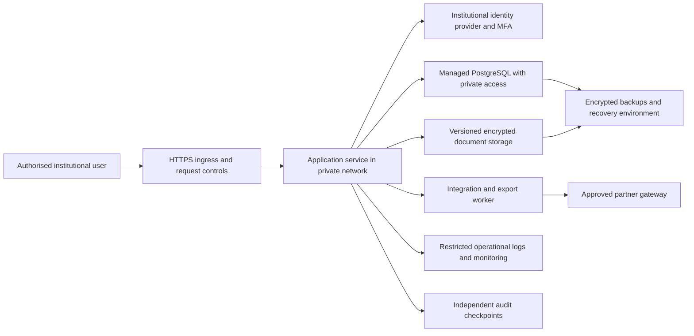

# Anvaya: clinical rationale and production completion requirements

**Research checked:** 30 September 2026. **Purpose:** explain five production gaps, the engineering work required to close them, and defensible presentation wording. This report documents design and acceptance criteria; it does not certify a deployment or report clinical outcomes.

The working application demonstrates study-readiness checks, participant consent records, safety workflows, scoped access, an audit chain, a FHIR research export and DM/AE-shaped CSV exports using synthetic records. Those foundations support a production implementation. They do not establish a validated SDTM submission package, an institutional EDC/HIS connection, a licensed terminology service or an approved cloud installation. Implementation status should be checked against the current [validation record](VALIDATION.md); this document concentrates on the remaining production requirements.

## 1. Clinical rationale: why the three enrolment gates matter

### Evidence and patient protection

CTRI requires prospective registration, before the first participant is enrolled. Its FAQ explicitly distinguishes an application **REF** number from an assigned **CTRI** registration number and includes traditional-medicine studies in its coverage. This supports recording an actual registration reference and date before recruitment starts. It does not prove that the reference entered in Anvaya is authentic. [CTRI FAQ](https://ctri.nic.in/Clinicaltrials/faq.php)

Informed consent protects a person's ability to understand and voluntarily choose participation. ICMR describes consent as an ongoing process and places it before study procedures. Its guidance also addresses re-consent and ethics-approved exceptions; a checkbox alone cannot establish understanding, capacity or a valid exception. [ICMR National Ethical Guidelines, sections 4–5](https://ethics.ncdirindia.org/asset/pdf/ICMR_National_Ethical_Guidelines.pdf)

GCP-ASU requires ethics review of consent materials and specifies participant information, consent documentation and renewal when material study conditions change. These requirements make protocol version, consent version and current approval operationally meaningful for an Ayurveda study. They are not merely administrative fields. [GCP-ASU guidelines, sections 2.4.3 and investigator responsibilities](https://ccras.nic.in/wp-content/uploads/2025/09/3.-ASU-GCP-Guidelines.pdf)

The following risk-to-control interpretation is our engineering rationale, not a measured finding about AIIA or Ayush research:

| Gate | Risk the workflow addresses | Software behaviour | Human evidence still required |
|---|---|---|---|
| Prospective registration | Recruitment can begin before the study's intended design is publicly recorded, weakening independent scrutiny of later changes. | Prevent enrolment until the configured study has recorded registration evidence; reject pending/REF-only entries. | Verify the official record, study identity and dates; retain the checker's identity and reference to the evidence. |
| Current IEC approval | Staff may act using an expired approval, superseded protocol or conditions that do not cover the activity. | Recheck approval status, validity, study status and effective versions when a relevant action occurs. | Confirm the approval covers the site, investigator, protocol, documents and activity; record suspension, renewal and conditions. |
| Correct consent | A participant may enter a workflow without evidence of agreement to the applicable study information. | Require the applicable consent version, language, time and recorder; preserve changes and withdrawal history. | Conduct and document the actual consent process, signatures/witnessing where applicable, and any IEC-authorised alternative. |

**Clinical distinction:** stopping recruitment or routine research procedures must not obstruct necessary clinical care or safety reporting. A withdrawal or lapsed study approval should send the case to a controlled safety/clinical review path, not hide adverse events. This is a proposed workflow policy for institutional approval.

### What makes the production gate stronger

1. Maintain a reviewed evidence record with issuer, study/site, document version, effective dates, decision, reviewer and a checksum of the original document.
2. Bind each gate decision to the exact evidence revisions evaluated. Recheck at transaction commit so concurrent amendments cannot invalidate an earlier screen-level check.
3. Separate approval validity from study duration. A date that is valid today is not proof that approval covers all future study activity.
4. Record re-consent requirements at amendment approval, including affected participants and activities; preserve the original consent and the replacement event.
5. Treat exceptional workflows as explicit, reviewed protocol/IEC configurations. Do not use a universal administrator bypass or invent a consent waiver.

**Evidence boundary:** no AIIA incident dataset, interviews or audit sample has established how often these failures occur. Avoid claims such as “Ayush trials are plagued by consent violations” or invented percentages. The defensible claim is that the software implements checks against documented trial-conduct requirements.

**Acceptance demonstration:** show an invalid registration case, expired approval, old consent version, concurrent amendment, withdrawal and a safety report after withdrawal. Each should produce the expected decision and attributable audit event without deleting source history.

## 2. From DM/AE-shaped CSV to a submission package

### Define the recipient before selecting standards

SDTM is a data model; its implementation guide supplies domain structure and usage rules. CDISC explicitly pairs **SDTMIG 3.4 with SDTM 2.0**. A project must select compatible versions and assess their acceptance for the intended recipient and study; choosing the newest item independently is insufficient. [CDISC SDTMIG 3.4](https://www.cdisc.org/standards/foundational/sdtmig/sdtmig-v3-4)

The FDA's June 2026 technical guide is a useful concrete submission reference, but FDA requirements do not automatically become requirements for every Indian Ayurveda study. The sponsor must identify the actual regulatory or research recipient and agree the package specification. For applicable FDA study datasets, the guide describes SAS XPORT v5 transport files with the `.xpt` extension, one dataset per file. Renaming a CSV to `.xpt` does not convert its format. [FDA Study Data Technical Conformance Guide, June 2026](https://www.fda.gov/media/153632/download)

**Terminology correction:** `--TPT` denotes a planned time-point name in SDTM; it is not a transport-file format. If “TPT export” means a submission file in a slide, use the agreed **XPT** wording instead. [CDISC SDTM timing-variable definitions](https://www.cdisc.org/standards/foundational/sdtm/sdtm-v1-7/html)

### Concrete delta from this repository

The existing source-to-export mapping is documented in [INTEROPERABILITY.md](INTEROPERABILITY.md). The following is a build specification, not a claim that these deliverables exist:

| Layer | Existing foundation | Required production deliverable |
|---|---|---|
| Data collection | A small participant/event schema; visit and consent workflows. | Protocol-approved CRFs, a data-management plan, missing-data conventions, edit checks and enough source fields to support the intended domains. [CDASH](https://www.cdisc.org/standards/foundational/cdash) may guide collection; it does not create missing observations. |
| Standards manifest | Recognisable DM/AE headings. | Pin SDTM, SDTMIG, terminology release, dictionary versions, mapping revision and recipient rules in every export manifest. |
| Identifiers and sequences | Synthetic study/participant IDs and generated CSV rows. | Approved study/site/subject identity rules; reproducible per-subject event sequencing and links back to immutable source-record identities. |
| Domain inventory | DM and AE previews. | Determine applicable domains from the study design and collected data: examples include DM, AE, DS, SV, EX/EC, CM, LB, VS, QS and trial-design domains. Do not generate fictional empty evidence to imitate completeness. |
| Dataset structure | Generic CSV strings and a limited column set. | Required/expected/permissible variable decisions, approved ordering, types, lengths, labels, keys, units, date precision and domain-specific record granularity under the pinned guide. |
| Semantics | Direct mappings from operational fields. | Reviewed transformation specification with origins, derivations, permissible values, handling of unknown/partial dates and source-to-target traceability. |
| Medical coding | Verbatim event text; supplied-dictionary lexical candidates and named coding review, demonstrated with fictional terms. | Authorised dictionary releases, validated full hierarchy/mappings, approved clinical coding practice and recipient-required output fields. |
| Transport | Downloadable CSV. | Recipient-approved dataset transport, with an actual writer and independent read-back comparison; XPT where required. |
| Metadata | Human-readable mapping notes. | Validated Define-XML describing the actual delivered datasets, variables, codelists, external dictionaries, origins and derivations. |
| Quality release | Prototype export tests. | Frozen source snapshot; automated conformance checks; reconciliation; documented findings; independent clinical-data/statistical review and authorised release. |

CDISC controlled terminology defines codelists and permissible submission values. Its public register lists a **25 September 2026** release. Record an approved release rather than allowing a live terminology update to silently change a frozen study export. Preserve the original collected value alongside the governed mapping. [CDISC Controlled Terminology](https://www.cdisc.org/standards/terminology/controlled-terminology)

For DM, review reference/exposure dates, participation end, site codes, planned/actual arms and collected demographics against the chosen guide. `RFICDTC` represents informed-consent timing; it must not be substituted indiscriminately for reference or first-exposure dates. For AE, preserve `AETERM` and assess dictionary-derived terms/hierarchy, stable `AESEQ`, end timing, outcome, relationship, actions and seriousness details. Applicability and missingness require explicit decisions; the current fields do not supply all of them. [CDISC SDTMIG 3.3 public domain examples and definitions, used here as explanatory reference rather than the proposed version lock](https://www.cdisc.org/standards/foundational/sdtmig/sdtmig-v3-3/html)

### Separate metadata, analysis and transport

Define-XML supplies machine-readable metadata for tabulation and analysis datasets. The implementation must validate its XML/schema, dataset references and consistency with exported values; a list of column names in an XML file is inadequate. [CDISC Define-XML](https://www.cdisc.org/standards/data-exchange/define-xml)

ADaM supports analysis and traceability to SDTM and results. It is a separate deliverable: the statistician must approve the statistical analysis plan, populations, endpoints, windows, baseline rules and derivations before analysis datasets are generated. An SDTM export alone does not deliver ADaM or demonstrate treatment efficacy. [CDISC ADaM](https://www.cdisc.org/standards/foundational/adam)

Use a rules engine with pinned versions, such as CDISC CORE for applicable CDISC rules, and add the recipient's validation rules. Automated checks support quality review; passing them is not regulatory acceptance or proof that the clinical meaning is correct. [CDISC CORE](https://www.cdisc.org/core)

**Recommended release pipeline:** approved source snapshot → reviewed mapping → domain datasets → controlled-terminology checks → metadata generation → transport encoding/read-back → validation findings → reviewer disposition → checksummed release manifest. Generate annotated CRF/reviewer materials when required by the recipient. These are clinical submission artefacts, separate from the user's SIH PPT; this task does not generate a presentation PDF.

**Completion evidence:** one agreed study package, all applicable domains reconciled to its frozen source, a reproducible build, approved handling of every blocking finding, and recipient acceptance testing. No synthetic benchmark can prove a real package clinically complete.

## 3. Moving from local SQLite to secure institutional hosting

### Regulatory position at this research date

The DPDP Act's commencement notification uses immediate, one-year and eighteen-month groups. As of 30 September 2026, the latter periods from the November 2025 publication have not elapsed. A production plan should map each obligation to its commencement rather than claim the entire framework has been effective since 2025. [MeitY commencement notification, G.S.R. 843(E)](https://www.meity.gov.in/static/uploads/2025/11/c56ceae6c383460ca69577428d36828b.pdf)

Final Rules 2025 similarly phase commencement: Rules 1, 2 and 17–21 immediately; Rule 4 after one year; Rules 3, 5–16, 22 and 23 after eighteen months. Later-tranche provisions include security, breach and retention requirements. In particular, Rules 6 and 8 contain one-year retention provisions, so a future design must not treat 180 days as a universal ceiling. Rule 7 distinguishes prompt notifications from the Board's detailed 72-hour update. [Final DPDP Rules 2025](https://www.meity.gov.in/static/uploads/2025/11/53450e6e5dc0bfa85ebd78686cadad39.pdf)

MeitY's official index also lists a December 2025 corrigendum. Its full PDF could not be retrieved in this pass; institutional legal review must use the consolidated instruments and confirm the operative calendar dates. The relative commencement periods above are taken from the retrieved official instruments. [MeitY DPDP Rules and corrigendum register](https://www.meity.gov.in/documents/act-and-policies/digital-personal-data-protection-rules-2025-gDOxUjMtQWa?pageTitle=Digital-Personal-Data-Protection-Rules-2025%3B)

The Act does not make every clinical-research application an automatically designated Significant Data Fiduciary or impose one universal localisation rule. Section 17's research exemption is conditional, including limits concerning decisions specific to a person; a CTMS managing individual participation should not assume blanket exemption. Section 16 addresses government restrictions on transfers. Clinical information needs strong protection, but the Act does not create a separate defined “sensitive personal data” category. [DPDP Act 2023, sections 2, 10, 16–17](https://www.meity.gov.in/static/uploads/2024/06/2bf1f0e9f04e6fb4f8fef35e82c42aa5.pdf)

CERT-In's 2022 directions cover specified cyber incidents reported within six hours of noticing or being informed, rolling 180-day ICT logs retained within India, clock synchronisation and an organisational contact. These are operational obligations, not a “CERT-In certification” automatically conferred by using a particular cloud. Cyber logs and incident clocks must remain distinct from clinical document retention and SAE reporting. [CERT-In directions, clauses i–iv and Annexure I](https://www.cert-in.org.in/PDF/CERT-In_Directions_70B_28.04.2022.pdf)

### Proposed hosting architecture

This is an engineering target; no supplier, cloud account, public deployment or compliance approval is implied.

Select an institution-approved India hosting arrangement for the initial design, including logs and backups. This is a procurement and risk decision and helps satisfy the specific ICT-log location requirement; it is not a declaration that every dataset has the same statutory localisation rule. Choose the smallest maintainable deployment that meets the agreed workload; PostgreSQL and extra workers become justified by concurrency, availability and operational requirements, not by the word “cloud.”

The current Python `http.server` runtime also needs a production-serving decision: Python's own documentation does not recommend it for production. Port the existing request/domain boundary to a maintained WSGI/ASGI deployment, or select an equivalent supported service architecture, then rerun the workflow and security tests. TLS termination alone does not validate the application runtime. [Python HTTP server documentation](https://docs.python.org/3/library/http.server.html)

| Control area | Proposed implementation | Evidence required before real participant data |
|---|---|---|
| Identity and scope | Named identities, institutional MFA, scoped roles/study membership, short sessions, access revocation and periodic review. | Positive and negative permission tests; departure/revocation drill; reviewed access register. |
| Network boundary | TLS ingress, private database, restricted administration, allowlisted partner destinations, sensible request/time limits. | Infrastructure review; certificate lifecycle; external exposure and penetration tests. |
| Secrets and encryption | Managed secrets and keys, rotation, encrypted disks/object storage/backups, separated operator privileges. | Key-access evidence; restore with authorised keys; failed access with unauthorised identity. |
| Privacy operations | Data inventory, identified institutional responsibilities, approved notices/purposes, rights and grievance workflow, processor terms. | Legal and ethics approval of actual processing flows, forms and contracts. |
| Record retention | Separate schedules for clinical source, essential documents, safety records, audit evidence, security logs and backups; legal holds. | Documented basis and retention owner for each class; tested expiry and hold behaviour. |
| Audit integrity | Transactional actor/before/after/reason records plus separately controlled checkpoints or immutable retention where specified. | Demonstrated tamper detection, access separation, export verification and recovery continuity. |
| Monitoring and incidents | Clock monitoring, log delivery alarms, availability/error alerts and rehearsed incident escalation. | Dated exercises, named on-call owners, incident records and retrieval of retained logs. |
| Continuity | Automated backups, failure alerts, protected copies and periodic restore exercises. | Measured recovery point/time against institution-approved targets; documented restoration run. |
| Release control | Environment separation, dependency tracking, review, regression/security testing and controlled migrations. | Approved release record and rollback rehearsal; synthetic-only staging. |

The existing SQLite backup utility is useful local recovery evidence. A successfully copied database does not prove cloud disaster recovery, document-store recovery or a service-level objective.

### SQLite-to-PostgreSQL migration sequence

1. Inventory every table, JSON field, object reference, account, study scope and audit record. Define target constraints and preserve identifiers.
2. Run a dry migration from a verified snapshot into an isolated environment. Preserve the **exact audit payload bytes and chain values**; reserialising historical JSON can break hash verification.
3. Compare entity counts, key sets, relationships, representative field hashes and audit heads. Reconcile document checksums and imported-source identities.
4. Run the same permissions, consent, readiness, safety and export tests against the target. Test concurrent updates and failed transactions.
5. Rehearse a short write freeze, final snapshot/load, reconciliation and approved switchover. Keep the prior database protected and read-only.
6. Set a rollback boundary. Once the new system accepts writes, returning to an older snapshot requires reconciling those writes; changing a connection string alone can lose records.

**Completion evidence:** approved hosting contract and responsibility matrix, successful migration and restore rehearsals, security testing, agreed capacity/recovery measurements, operational ownership and institutional acceptance. Cloud storage by itself satisfies none of these checks.

## 4. Integrating an existing EDC or hospital system

### Start with one authorised interface

Choose a specific partner, edition, API version and permitted data flow. Review its documentation, data-use authority, sandbox and authentication model. A FHIR export from Anvaya is not proof that a hospital exposes a compatible API. FHIR servers describe supported resources and operations using a CapabilityStatement; authentication and authorisation remain separate concerns. [FHIR R4 REST API](https://hl7.org/fhir/R4/http.html)

For unattended service access, use OAuth 2.0 client credentials when the partner supports that grant for a confidential client. It authenticates a service; it does not establish participant research permission. [OAuth 2.0, RFC 6749 section 4.4](https://www.rfc-editor.org/rfc/rfc6749#section-4.4)

Where supported, SMART Backend Services specifies discovery, pre-authorised scopes, an asymmetric JWT client assertion, and short-lived tokens. Use `system/` permissions limited to the agreed resources; keep credentials on the server. Interactive clinician launch has a different SMART flow. Do not label a generic API-token connector “SMART certified.” [HL7 SMART Backend Services 2.2](https://hl7.org/fhir/smart-app-launch/backend-services.html)

### Proposed gateway and reconciliation flow

1. **Receive:** a partner adapter obtains the authorised file/API payload. Record source system, record ID, source version, study/site, event time, receipt time, payload hash, mapping version and service identity. Preserve the permitted original payload in restricted storage.
2. **Validate:** check size/type/schema/profile, code systems, units, timestamps, study binding and allowed fields. Reject direct identifiers not authorised for transfer. Do not put narratives, tokens or raw records in operational logs.
3. **Stage:** create an import batch with immutable raw-reference metadata and row-level validation findings. An accepted HTTP request means “received,” not “enrolled” or “clinically approved.”
4. **Map:** apply a reviewed versioned transformation to the internal research model. Preserve original and normalised values. Do not equate biological sex with administrative gender, or a routine hospital encounter with a trial visit.
5. **Match:** use the institution's approved study-subject linkage. Ambiguous identity or unexpected site/study membership requires review; fuzzy name matching must never silently merge participants.
6. **Reconcile:** reviewers inspect source/current/proposed values and approve, reject or open a query with reasons. Updates to reviewed records become new versions rather than silent replacement.
7. **Commit:** call the same authorised domain operations used by the UI. Registration, IEC, consent, withdrawal, amendment and study-scope checks must still run inside the write transaction.
8. **Acknowledge:** return a stable receipt and row statuses. Support safe retries, reconciliation reports, mapping rollback and retained rejection reasons.

The proposed idempotency key is `(source_system, source_record_id, source_version, target_study)`. The same key and hash returns the previous outcome; the same key with different content becomes a conflict. A newer source version triggers an explicit update/review path. Source timestamps do not replace server receipt or reviewer timestamps. FHIR Provenance can describe source entities, agents and transformations when a partner's exchange contract supports it. [FHIR R4 Provenance](https://hl7.org/fhir/R4/provenance.html)

FHIR candidates include Observation for measurements, QuestionnaireResponse for responses and suitable medication/procedure resources for interventions; actual profiles and mappings require semantic review. A non-FHIR EDC may need its native REST, ODM or approved CSV adapter. The gateway is deliberately partner-specific rather than a promise of automatic universal integration.

### CTRI and ABDM boundaries

The official CTRI FAQ describes user registration, online forms, document upload and review. This research has not established a public write API. The practical first connector is a reviewed registration-data preparation/export workflow with recorded human submission and verification; do not automate website credentials or invent a filing endpoint. [CTRI registration process](https://ctri.nic.in/Clinicaltrials/faq.php)

The researched ABDM guide is version 6.5.0 and includes a DocumentBundle for clinical documents. Anvaya's research collection Bundle does not meet that exchange contract merely because both use FHIR. HIP/HIU onboarding, approved consent exchange, the selected document profiles and sandbox acceptance remain distinct integration work. [NRCeS ABDM FHIR implementation guide](https://nrces.in/ndhm/fhir/r4/)

**Completion evidence:** one authorised partner sandbox, documented mapping and credential scopes, profile validation, retries/duplicates/conflicts tested, zero unexplained reconciliation differences, and partner sign-off. Record ingestion latency and failure recovery under an agreed workload; do not publish an unmeasured “real-time integration” claim.

## 5. Licensed MedDRA and WHODrug terminology assistance

### Different dictionaries solve different problems

MedDRA supports consistent coding of reported medical concepts. Its March 2026 term-selection guidance calls for trained review, current lowest-level terms, hierarchy checks and preserving reported meaning without adding a diagnosis from symptoms. It explicitly recognises the need for human oversight of coding tools. [MedDRA Term Selection: Points to Consider, release 4.26](https://files.meddra.org/www/Website%20Files/PtCs/001329_termselptc_r4_26_mar2026%20%281%29.html)

WHODrug identifies medicinal products and ingredients and supports drug coding; it covers conventional medicines and herbal remedies. A product dictionary does not code an adverse-event diagnosis. Access to dictionary files and services depends on the organisation's subscription. [UMC WHODrug Global](https://who-umc.org/whodrug/whodrug-global/what-is-whodrug-global/), [UMC applications and access](https://who-umc.org/whodrug/whodrug-global/applications-and-services/)

Before implementation, obtain the applicable MedDRA/WHODrug access rights and review use, deployment, redistribution and third-party processing conditions. Do not put licensed dictionary files in public GitHub, downloadable demo bundles or an external model service without permission. [MedDRA browser licence terms](https://tools.meddra.org/wbb/eula.htm)

### Proposed assistant pipeline

| Step | Engineering design | Review control |
|---|---|---|
| Licensed version import | Store approved dictionary release, language, provenance and checksum in restricted storage. | Terminology owner approves release and permitted use. |
| Verbatim preservation | Keep original event/drug text, language, context and record version unchanged. Normalisation is a separate derived field. | Reviewer can compare the source and every suggestion. |
| Exact matching | Match approved aliases and licensed dictionary entries after conservative case/spacing normalisation. | Exact text does not guarantee the medically correct concept; reviewer approval remains mandatory. |
| Lexical retrieval | Retrieve candidates using token, spelling and approved synonym matching. | Display matching evidence; avoid destructive removal of negation, qualifiers or temporal context. |
| Optional NLP ranking | Rank retrieved candidates with an evaluated local model or approved service; return a small top-k list. | Suggestions must resolve to real entries in the pinned dictionary. No invented terms or free-text diagnoses. |
| Abstention | Flag ambiguous concepts, negation, insufficient detail, incompatible language and close competing candidates. | Route to clarification or manual coding; do not force a code to make a dashboard green. |
| PV approval | A trained reviewer selects or rejects the candidate and records the rationale. | Only approved coding enters released exports. |
| Version change | Analyse dictionary changes and produce a proposed recoding queue. | Preserve old coding and release lineage; never silently rewrite a frozen package. |

For WHODrug, capture enough product context to distinguish brand, ingredient, formulation, strength and country when relevant. Preserve manufacturer/batch evidence separately; dictionary identity is not batch-quality evidence. Unmatched Ayurveda formulations should remain unresolved or use an approved coding procedure, not be mapped to a superficially similar product. UMC publishes coding guidance and a version-change analysis service that can inform the governed workflow. [UMC documentation](https://who-umc.org/whodrug/documentation/), [WHODrug applications](https://who-umc.org/whodrug/whodrug-global/applications-and-services/)

### Evaluation and release criteria

The following are proposed measurements, not achieved scores:

- Create an authorised, de-identified reference set with independent trained coders and adjudication. Separate evaluation by event/drug task, language, common/rare concepts and ambiguity.
- Split related cases together and hold out evaluation records from tuning. Keep dictionary and model versions fixed during a reported evaluation.
- Measure top-1 correctness, top-k recall, reviewed acceptance/override rate, abstention coverage and error rate among suggestions shown. Add reviewer time per case and clinically significant miscoding review.
- Call an output “confidence” only after checking calibration. A string-similarity score or model probability is not automatically a trustworthy clinical probability.
- Select thresholds with the PV lead using the cost of specific error types. Document uncertainty and sample size; do not invent a 95%/99% accuracy claim from synthetic examples.
- Audit candidate set, dictionary/model versions, reviewer identity, final code, reason and time. A held-out regression set must pass before an update is promoted.

This assistant supports **terminology selection**. It does not independently determine causality, seriousness, expectedness, diagnosis or a reporting obligation. No licensed coding or model-performance claim is made for the current prototype.

## 6. Compact slide additions

These blocks are suggested presentation edits. They intentionally distinguish demonstrated functions from production delivery conditions.

| Template location | Copy-ready content |
|---|---|
| Abstract / challenges | **Clinical governance built into the workflow:** Anvaya checks recorded registration, current ethics approval and applicable consent before enrolment, while preserving safety and audit records. |
| Unique value | **Explainable enrolment gates:** each blocked action identifies the missing evidence, so the coordinator knows what must be corrected and the reviewer can trace the decision. |
| Technical approach | **Structured research data:** the prototype exports linked FHIR research resources and DM/AE mapping previews. Submission delivery requires approved mappings, terminology, metadata and recipient validation. |
| Feasibility | **Controlled institutional rollout:** approved hosting, verified migration, recovery exercises, scoped identity and one validated partner integration form the production acceptance path. |
| Integration | **Governed ingestion:** partner data passes authentication, validation, provenance, duplicate checks and reconciliation before existing clinical gates permit a write. |
| Terminology roadmap | **Reviewer-controlled coding assistance:** licensed MedDRA/WHODrug retrieval supplies candidate terms; trained reviewers approve coding, and ambiguous cases remain unresolved. |
| Impact | **Measurable process quality:** assess prevented invalid actions, reconciliation completeness, review turnaround and recovery success in a supervised pilot; do not present targets as measured clinical benefit. |

Use the direct source links in the relevant sections for reference-slide hyperlinks. The strongest completed-work claim is the demonstrable software behaviour; the strongest feasibility claim is a concrete acceptance path with named dependencies.

## 7. Judge questions and concise answers

**Why does a trial dashboard block enrolment?** It converts recorded registration, approval and consent requirements into checks at the moment of action. Staff still verify the real evidence and conduct the consent process; software does not replace clinical or ethics judgement.

**Do you have evidence that AIIA currently violates these requirements?** No. Our rationale comes from documented conduct requirements and the requested workflow. We have not measured AIIA failure rates or claimed institution-specific misconduct.

**Are your CSV files SDTM submission-ready?** No. They demonstrate mappings. A release needs compatible standard versions, complete applicable domains, controlled terms, reviewed transformations, proper transport, Define-XML and recipient-specific validation.

**Why use SQLite now if you want secure cloud deployment?** It supports a reproducible local prototype. Institutional deployment adds operational controls and, when justified, a verified PostgreSQL migration. Database selection alone does not establish security or compliance.

**Are you CERT-In certified or fully DPDP compliant?** We make neither certification claim. The hosting design maps controls to applicable duties and phased commencement; operational evidence and institutional review remain required.

**Does six-hour reporting apply to an SAE?** The six-hour rule discussed here is for specified cyber incidents under CERT-In. Clinical safety reporting follows the study's applicable rules, actors and protocol; it is a separate workflow.

**Can you connect to our hospital tomorrow?** We can scope one documented, authorised interface and validate it in a sandbox. A working FHIR export does not establish partner credentials, identity matching, permitted use or acceptance.

**Does a service token permit research use of every patient record?** No. Technical authorisation is restricted by the partner agreement and the applicable legal, ethics and participant-permission basis. Imported data must still satisfy study workflow gates.

**Is the AI diagnosing adverse reactions?** No. The proposed assistant retrieves licensed terminology candidates for trained review. It must abstain when evidence is insufficient and does not establish causality or diagnosis.

**What remains outside a student team's control?** Institutional evidence approval, authorised clinical data, partner/sandbox access, dictionary rights, hosting procurement and formal validation/acceptance. Those dependencies are explicit completion gates, not features made complete by slide wording.
