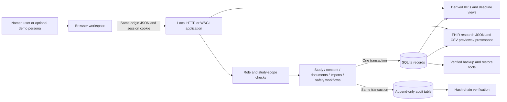
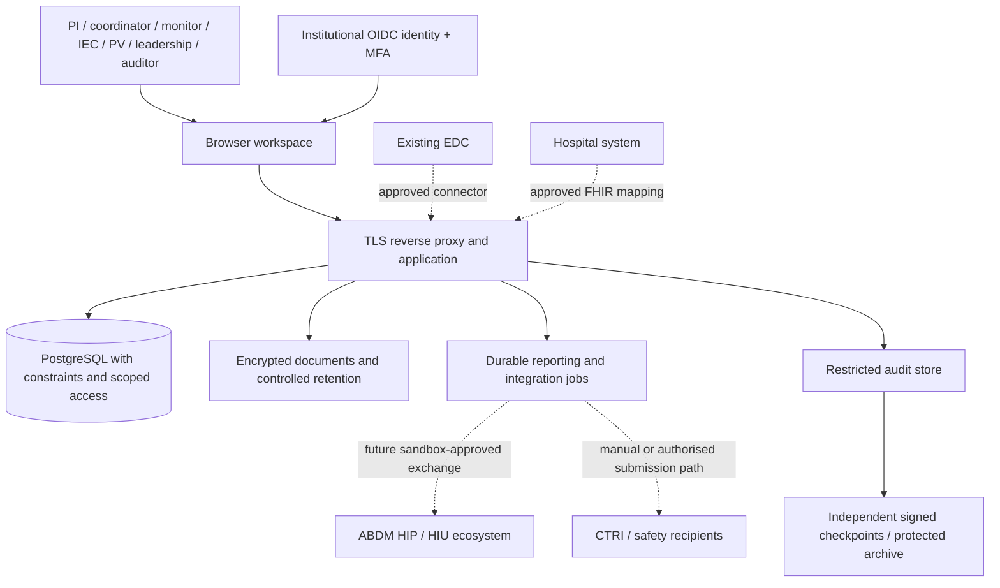
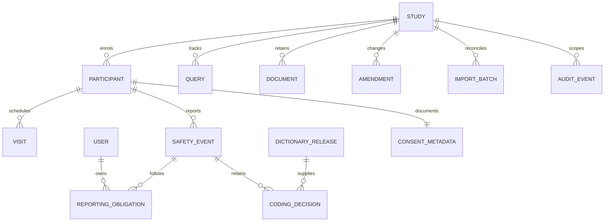

# Anvaya — Technical Requirements and Architecture

**Version:** 1.1 · **Date:** 30 September 2026  
Companion documents: [PRD](PRD.md), [regulatory traceability](REGULATORY_TRACEABILITY.csv), [workflows](WORKFLOWS.md), [sources](SOURCES.md).

## 1. Architecture decision

Use a single Python application process, a SQLite database and browser-native HTML/CSS/JavaScript. The local `server.py` transport runs with Python's standard library and needs no frontend build or cloud subscription. The optional deployment transport adapts the same handlers to WSGI and serves them with pinned Waitress 3.0.2 behind Caddy. Both paths use the same workflow modules and persistent records.

Accounts, documents/amendments, exchange and safety follow-up are separate Python modules within one application. They share authorisation, the transaction boundary and the audit ledger. The current tested topology has one process, one in-memory session store and one process-wide lock; eight Waitress threads do not remove that serialisation. Performance and capacity have not been measured. A pilot may retain this structure if its accepted workload and operating requirements support it; institutional identity, data governance and hosting still need separate acceptance.

### Implemented container view



### Institutional target context



Dotted edges are proposals, not working integrations. OIDC/MFA, PostgreSQL, external object storage, durable delivery jobs and protected independent audit archives in this target diagram are not current runtime components. The implemented files and metadata remain in SQLite; external reports are manually recorded. No source system should be replaced without identifying its authoritative fields and reconciliation process.

## 2. Repository map and execution

| Location | Responsibility |
|---|---|
| `server.py` | Shared HTTP handlers, sessions, role definitions, study/participant workflows, storage, metrics, exports and audit |
| `accounts.py` | Named account creation, password hashing, study assignments, access changes and revocation versions |
| `documents.py` | Immutable document versions, independent review, active-study amendments and reconsent |
| `exchange.py` | Synthetic CSV mapping/preview/commit, source identity and provenance, local FHIR checks |
| `safety_workflow.py` | Dictionary packages, lexical suggestions, reviewed coding and recipient obligations |
| `wsgi.py` | WSGI request/response adapter reusing the same handlers; `create_app()` initialises storage |
| `ops.py` | Online backup, read-only verification and restoration to a new path |
| `public/index.html` | Document shell, native modal and live-status region |
| `public/app.js` | Navigation, role-aware controls, forms, fetch, tables and SVG chart |
| `public/workflows.js` | Named access, evidence/amendment/reconsent, import and integration screens |
| `public/safety.js` | Dictionary upload, suggestions/review, coding history and recipient follow-up forms |
| `public/style.css` | Responsive layout, tokens, components and focus styles |
| `public/favicon.svg` | Local vector identity; no external image dependency |
| `data/ctms.sqlite` | Generated local demo database; ignored by version control |
| `requirements.txt` | Optional deployment dependency: `waitress==3.0.2` |
| `Dockerfile`, `compose.yaml`, `Caddyfile` | Non-root application image, persistent storage, single service and TLS reverse-proxy configuration |
| `tests/test_api.py`, `tests/test_accounts.py`, `tests/test_documents.py` | Core/API integrity, named access and independent review tests |
| `tests/test_exchange.py`, `tests/test_safety_workflow.py` | Reconciliation, coding and recipient-state verification |
| `tests/test_ops.py`, `tests/test_runtime.py` | Recovery and WSGI transport checks |
| `tests/test_browser.py`, `tests/test_browser_extended.py` | Two isolated Chrome workflow scripts and screenshots |
| `tests/run_checks.py` | Suite runner; `--browser` includes both browser workflows |
| `docs/` | Product, design, research, workflows and validation evidence |

Run `python3 server.py --port 8046`. Default bind is `127.0.0.1`; the documented port is 8046 because another local application occupied port 8000. Python 3.10+ is required by the implementation. Chrome or another current browser handles native dialogs, fetch and SVG.

The local runtime uses only Python's standard library. Waitress is needed only for the optional WSGI deployment path; Playwright is a development/test dependency. Restart invalidates process-memory sessions but preserves database records, users, password hashes and saved workflow state.

| Configuration | Behaviour |
|---|---|
| `CTMS_DB` | SQLite file; default `data/ctms.sqlite` |
| `PORT` / `--port` | Local HTTP listener port |
| `CTMS_DEMO_LOGIN` | Optional shared-role login; local default `true`, Compose default `false` |
| `CTMS_DEMO_PASSWORD` | Override shared demo password; the browser's default hint must be adjusted separately |
| `CTMS_ADMIN_USERNAME` / `CTMS_ADMIN_PASSWORD` | Bootstrap one named administrator when the user table is empty; password must satisfy the 12–128-character rule |
| `CTMS_SECURE_COOKIE` | Add the cookie Secure attribute; Compose sets `true` |
| `ANVAYA_DOMAIN` | Required deployment hostname used by Caddy; does not itself establish DNS or certificate issuance |

Startup creates missing tables before checking for an existing study dataset, so new modules can be added without reseeding an existing demonstration. If demo login is disabled and there is no active named administrator, startup fails with a bootstrap instruction. The bootstrap environment variable does not reset an already provisioned account.

## 3. Storage model

The application stores validated JSON records in SQLite tables keyed by `id`. Application code validates relationships; database foreign keys do not connect the embedded JSON objects. Study setup/activation, account updates and amendment approval use revision checks where described below. Other workflows enforce state transitions or immutable versions. A larger or multi-process deployment needs a deliberate relational schema, uniqueness/relationship constraints and controlled migrations before it can rely on database-enforced concurrency.

| Table | Key | Important fields |
|---|---|---|
| studies | `id` | title, type, condition, formulation, batch, site, target, status, protocol, consent_version, revision, registry reference/date, IEC reference/approval date/expiry, activation time/actor, NDCT flag, internal safety hours, start/end |
| participants | `id` | study_id, age, sex, Prakriti, status, consent flag/version/language/time/recorder, consent_history, reconsent_required/current required version, enrolment time, site, withdrawal time, optional import provenance |
| visits | `id` | study_id, participant_id, name, scheduled date, completion timestamp |
| events | `id` | study_id, participant_id, verbatim term, narrative, seriousness, severity, occurrence, awareness, server receipt, initial/analysis record metadata, coded_term and coding_history |
| queries | `id` | study_id, field, message, open time, status, resolution, resolved time |
| settings | `alerts` | recruitment pace threshold, IEC warning days, query aging days |
| users | `USR-*` | normalised username, name, role, assigned scope, active, password_hash, must_change_password, auth_version, revision, creation/update timestamps |
| documents | `DOC-*` | study_id, kind, version, filename/media type, byte size, SHA-256, content_base64, status, uploader and independent reviewer metadata |
| amendments | `AMD-*` | study_id, three approved document IDs, proposed IEC metadata/target, submitted study revision, submitter/reviewer, status, applied revision, reconsent count |
| imports | `IMP-*` | study_id, source name/hash, exact field mapping, staged rows and errors, counts, review/commit metadata |
| dictionaries | `DICT-*` | name, version, kind, immutable code/label terms, term_count, SHA-256, licence declaration, importer/time |
| obligations | `OBL-*` | event/study, manual recipient and phase, named assignee, deadline/rule basis, state, actual dispatch/receipt timestamps, references, entry metadata, escalation history |
| audit | increasing integer `seq` | canonical payload, previous hash, current hash |

### Logical relationships



`CONSENT_METADATA` and previous versions are embedded in participants. `CODING_DECISION` is embedded in an event's current code/history. These diagram entities describe logical relationships, not extra SQL tables. Named study assignments are stored in the user's scope array. Document content is base64 in SQLite; list responses and audit payloads expose metadata and hashes, not file contents. Dictionary list responses similarly omit complete terms.

### Production schema additions

Future normalised entities may include Institution, Site, UserStudyAssignment, ProtocolVersion, EthicsSubmission, Approval, RegistryRecord, ConsentEvent, Signature, ProcessingPermission, InvestigationalProduct, Batch, ProcedureSession, Assessment, Deviation, MonitoringVisit, DeliveryAttempt, MappingVersion and ExportManifest. Users, documents, amendments, import batches, dictionary versions and reporting obligations already have working stored representations; they are not entirely deferred features.

Add these only when implementing their workflows. Use foreign keys and unique constraints for stable external identifiers; optimistic version numbers for concurrent edits; encrypted object references rather than database blobs for approved documents; a separate restricted identity mapping for any re-identification need.

## 4. API contract

JSON mutation body maximum: **800,000 bytes**, with an object required at the top level. POST success is `{ "ok": true, ... }`; many reads return a scoped object/array wrapper directly. Errors are `{ "error": "actionable message" }`. Typical statuses: 400 invalid input, 401 unauthenticated/revoked session, 403 scope/permission/CSRF/temporary-password restriction, 404 absent record, 409 stale revision or invalid transition, 429 login throttling. The WSGI adapter returns 405 for methods other than GET/POST.

| Method and route | Behaviour | Permission |
|---|---|---|
| GET `/api/health` | Public synthetic-demo health indicator | Public |
| GET `/api/config` | Whether optional demo-role login is enabled | Public |
| GET `/api/roles` | Public demo persona choices | Public |
| POST `/api/login` | Named username/password, or enabled demo role/password; new random session | Public, throttled |
| GET `/api/me` | Current principal, assignments, password-change flag and CSRF token | Session |
| POST `/api/logout` | Revoke current session cookie | Session + CSRF |
| POST `/api/account/password` | Verify current password, set different password, clear temporary flag, revoke other sessions | Named session + CSRF |
| GET `/api/users` | Public account metadata without password hash | users |
| POST `/api/users` | Create named account, role and scope; force first password change | users |
| POST `/api/users/{id}/access` | Revision-checked role/scope/active changes; invalidate sessions | users |
| POST `/api/users/{id}/reset` | Revision-checked temporary-password reset and session invalidation | users |
| POST `/api/users/{id}/revoke` | Revision-checked session invalidation with reason | users |
| GET `/api/data` | Scoped snapshot, metrics, alerts and record arrays | Session |
| POST `/api/studies` | Create locked draft study | study |
| POST `/api/studies/{id}/setup` | Edit Setup metadata with reason and expected revision | study |
| POST `/api/studies/{id}/activate` | Recheck readiness; require review, reason and revision; open recruitment | study |
| POST `/api/enrolments` | Validate gates, save participant and two visits | enrol |
| POST `/api/participants/{id}/withdraw` | Record withdrawal reason and timestamp | withdraw |
| POST `/api/participants/{id}/reconsent` | Record current-version consent and preserve previous metadata | enrol |
| POST `/api/visits/{id}/complete` | Record actual completion entry and reason | visit |
| POST `/api/safety` | Capture AE/SAE and derive deadline view | safety |
| POST `/api/safety/{id}/report` | Record external initial/analysis metadata | report |
| POST `/api/dictionaries` | Import immutable 1–2,000-term release with metadata and licence declaration where required | settings + named account |
| GET `/api/safety/{id}/suggestions?dictionary_id=…` | At most five Synthetic/MedDRA lexical candidates or abstention | safety or report, study scope |
| POST `/api/safety/{id}/coding` | Confirm supplied release/code/reason; retain prior coding | report + named account |
| GET `/api/safety/{id}/assignees` | Active named reporting accounts with access to event's study | report |
| POST `/api/safety/{id}/obligations` | Create manual recipient/phase/deadline/rule-basis/owner record | report |
| POST `/api/obligations/{id}/dispatch` | Record actual sent_at, external reference and reason | report |
| POST `/api/obligations/{id}/receipt` | Record actual received_at, external reference and reason after dispatch | report |
| POST `/api/obligations/{id}/escalate` | Append external follow-up reason/actor/time while pending | report |
| POST `/api/documents` | Named upload of a new Protocol/Consent/IEC version | document + named account |
| GET `/api/documents/{id}` | Download file bytes with attachment headers and audit event | Scoped non-leadership session |
| POST `/api/documents/{id}/review` | One Approved/Rejected decision, different named account from uploader | review + named account |
| POST `/api/amendments` | Submit active-study change referencing approved evidence | amend + named account |
| POST `/api/amendments/{id}/approve` | Independent approval, current revision/readiness recheck, apply and flag reconsent | review + named account |
| POST `/api/imports/preview` | Save mapped synthetic CSV review without adding participants | import + enrol |
| GET `/api/imports/{id}` | Inspect staged rows and errors within assigned study | import |
| POST `/api/imports/{id}/commit` | Reviewed atomic enrolment/reconciliation; repeat committed batch is idempotent | import + enrol |
| GET `/api/exchange/check` | Local structure/reference checks on scoped research Bundle | export |
| POST `/api/queries/{id}/resolve` | Resolve an open query with explanation | query |
| POST `/api/settings` | Change operational thresholds | settings |
| GET `/api/audit` | Scoped history and full-chain verification result | audit |
| GET `/api/export/fhir` | Linked R4 research bundle; optional `?study=` | export |
| GET `/api/export/dm` | Demographics mapping preview CSV | export |
| GET `/api/export/ae` | Adverse-event mapping preview CSV | export |
| GET `/api/export/provenance` | Scoped participant/source/import/hash lineage CSV | export |

Example enrolment body:

```json
{
  "study_id": "AIIA-001",
  "age": 35,
  "sex": "F",
  "prakriti": "Not assessed",
  "consent": true,
  "consent_version": "2.1",
  "consent_language": "English"
}
```

Study setup and activation endpoints require the administrator's `study` permission. They never accept a caller-supplied status or safety classification. Setup saves separate protocol and consent versions, formulation/batch, investigator, registry/IEC metadata and dates. Changes require a reason and expected `revision`; activation also requires `reviewed: true`. Stale revisions or active-study edits through the setup endpoint return 409. Active studies instead use the reviewed amendment endpoints. New activations require an IEC approval date; older active demo records retain the pre-existing reference/expiry gate and expose missing historical dates. Loading does not fabricate approval dates.

All study-linked routes recheck server-side study access; permission names in the table do not waive that scope. Named account requirements apply specifically to dictionary import, coding confirmation, document upload/review and amendment submission/approval. Recipient updates, reconsent and CSV intake can use an authorised demo principal when that optional mode is enabled, with explicit demo attribution. Metadata for documents, amendments, dictionaries and obligations arrives through the scoped snapshot; there is no separate public dictionary-terms listing endpoint.

## 5. Identity, permissions and request safety

Successful named or enabled demo login issues a cryptographically random token held in process memory and an HttpOnly, SameSite=Strict cookie with an eight-hour lifetime. `CTMS_SECURE_COOKIE=true` adds Secure; this is enabled in Compose. Authenticated POST requests require the session's CSRF token. When Origin is supplied, its network location must match Host. Failed logins are throttled by client address and normalised login identity, with a 15-attempt/60-second limit. The deployment's explicitly trusted proxy supplies the client address; arbitrary forwarding headers are not an identity mechanism.

Named passwords contain a random 16-byte salt and use PBKDF2-HMAC-SHA256 with **600,000 iterations**. Password comparison uses `hmac.compare_digest`. Passwords must be 12–128 characters and not whitespace-only. Account APIs and audit events remove `password_hash`; plaintext passwords are not returned or logged in audit payloads. The SQLite database still contains credential hashes and requires protected storage.

Usernames are normalised to lowercase and must be unique. A named account has a role plus an explicit study-scope array; this assignment replaces the role's seeded demonstration scope. Named administrators have institution-wide scope, represented by `null`; non-administrators require a validated array, which may be empty. Role permissions remain server-defined.

New/reset accounts have `must_change_password=true`. They may inspect their session, change the temporary password or sign out, but cannot read the operational snapshot or perform ordinary workflow mutations. Password change verifies the existing password and requires a different new one. It increments `auth_version`, preserves the current session at the new version and invalidates other sessions. Access changes, disabling, administrative reset and explicit revoke also increment `auth_version`; the server reloads the user and verifies active state/version on each authenticated request. Thus stale sessions fail before they can use old scopes. Account mutations require a current revision and reason, prevent self-removal of administrative access, and protect the last active named administrator.

The principal is read from the server session and, for named users, refreshed from the saved account. `authorized()` checks action and study scope. Snapshot filtering also runs on the server. Leadership receives aggregate values and empty participant/event/query/visit/document/amendment/recipient arrays; raw audit and exports require explicit permissions. Only account administrators receive user metadata. Import summaries require import permission. The UI hiding a button is a usability feature, not the security boundary.

The browser discards in-flight snapshot and audit responses when the session changes; safety asynchronous responses also check session identity. This prevents a prior administrator response from populating those views after switching to a narrower role. Optional shared-role login still lets a holder of the demo password choose any demonstration persona. Its actor IDs are labelled `demo:<role>`; named actions use `USR-*`. Compose disables shared-role login by default.

Static routes use an explicit allowlist. Database paths, source code and documentation are not served by a generic filesystem handler. Dynamic strings are escaped before insertion into HTML. CSV values beginning with spreadsheet formula markers are neutralised. Security headers include CSP, nosniff and frame denial.

Pilot requirements include institutional OIDC/SSO or approved equivalent identity assurance, MFA, access approval/review, real HTTPS operation, approved session/recovery policy, security event logging, least-privilege storage access and penetration testing. Named accounts, session revocation, configurable Secure cookies and a trusted-proxy deployment configuration already exist; institutional identity assurance, actual public TLS and approved hosting have not been established by those features. Default local HTTP and unencrypted SQLite must not be presented as a validated environment for real participant records.

## 6. Transactions, concurrency and recovery

SQLite connections use a context manager and close after operations; named-session validation may open a separate read connection. A process-wide re-entrant `LOCK` serialises authenticated handlers and mutations. SQLite WAL is enabled. Successful mutations and audit appends run in the same transaction; an exception rolls back the operation. This includes multi-participant import commits and amendment approval with all affected reconsent flags. Downloads and exports append their own audit events.

The lock, JSON records and full-table scans remain scaling limits. Waitress provides the implemented deployment HTTP server, but it does not make the application multi-process safe: sessions, throttles and the lock remain process-local. Run one application process/service instance with the supplied topology. Multiple replicas require a shared session/throttle design and database constraints/concurrency control, with measured performance evidence. A server restart is unnecessary to refresh records, but backend-code changes require a restart and invalidate sessions.

Duplicate query resolution, visit completion, document review, event reporting and recipient dispatch/receipt return conflicts. Import commit is idempotent for an already committed batch. Import source identity also prevents duplicate enrolment across new previews of the same unchanged source row. General idempotency keys are not implemented for manual create endpoints; a lost response followed by a manual enrolment/event retry can still create a second record. This distinction must remain visible in API contracts and any future adapter.

`ops.py` uses SQLite's online backup API, including committed WAL records, and produces a standalone database with DELETE journal mode. It verifies SQLite integrity, required core tables and the audit chain; failed copies remove their partial output. Source access is read-only. The tool refuses existing destination files, symlinks or recovery sidecars and creates the destination with mode `0600`. Verification inspects one read snapshot. Restore also writes a new path and never switches a running application's database automatically.

```sh
python3 ops.py backup /approved-backups/anvaya-new.sqlite
python3 ops.py verify /approved-backups/anvaya-new.sqlite
python3 ops.py restore /approved-backups/anvaya-new.sqlite /approved-recovery/anvaya-restored.sqlite
```

Destination parent directories must exist and output paths must be unused. After reviewing the restored copy, an operator stops the service and points `CTMS_DB` to it through the approved change process. Backup files contain the complete database, including accounts, documents and dictionary terms, so approved encrypted storage, restricted access, off-host retention and a schedule remain operational requirements. Isolated restore tests pass; institution-specific recovery time/data-loss targets and disaster-recovery drills are still unmeasured. Do not copy only a live SQLite main file and ignore its WAL.

### 6.1 Document and amendment state transitions

A named account with `document` permission uploads a Protocol, Consent or IEC version. Accepted input is PDF or UTF-8 TXT, 1 byte–512 KiB, with a safe filename and format checks. These checks are not malware scanning or proof of an authentic signature. Each study/kind/version is unique, and replacing bytes under an existing version is rejected. The stored content hash and upload metadata accompany a `Submitted` state. A different named account with `review` permission can record one Approved or Rejected decision with reason. Download access is scoped and excludes leadership; file bytes are not embedded in list/audit payloads.

A named PI or administrator can submit an amendment only for Recruiting/Follow-up studies. The request selects approved Protocol, Consent and IEC documents from that study and proposes IEC reference/approval/expiry and enrolment target; protocol and consent versions come from the selected files. At least one supported field must change. The target cannot be below existing cumulative enrolment. Submission records the current study revision. A different named reviewer approves only if the revision and active state still match, evidence remains approved, target still accommodates enrolment, and readiness passes.

Approval updates the study and amendment atomically. If the consent version changes, active consenting participants receive `reconsent_required` plus the required version and amendment identity; each change is audited. Routine visit completion blocks outstanding reconsent. Recording current-version reconsent requires consent attestation, language and reason, preserves previous consent metadata, and clears the pending flag. Withdrawn participants cannot use this action. These are attributable workflow records, not validated electronic signatures; an in-app Approved status is not independent confirmation of an IEC's external decision.

### 6.2 Synthetic intake and reconciliation

Preview accepts `synthetic: true`, study, source name, CSV text up to 100,000 characters, and an optional complete canonical-to-source mapping. The canonical fields are `external_id`, `age`, `sex`, `prakriti`, `consent_version`, `consent_language` and `consent_confirmed`. Every field must map to a distinct named source column. Headers must be unique and contain all mapped columns; additional unmapped columns are permitted. CSV parsing is strict, row widths must match the header, and a review batch contains 1–100 rows. Values undergo the same supported age/sex/Prakriti/language validation, explicit true consent and current consent-version check.

Preview persists a review record, source SHA-256, exact mapping and row results without creating participants. Source identity is `SHA256(canonical([source_name.casefold(), study_id, external_id]))`; the row fingerprint hashes the canonical mapped/trimmed source values. Repeated external IDs within a batch are rejected. An existing identity with identical values becomes Already imported; changed values under the same identity require reconciliation and are rejected. The original CSV is represented by its hash and staged mapped records; no live EDC API connection is implied.

Commit requires import and enrolment permissions, study access, explicit review and reason. Any rejected row blocks the entire batch. New rows go through the existing enrolment handler, which rechecks current study readiness, capacity and consent; a failure rolls back the whole transaction. Identical existing rows are skipped, and a committed batch can be retried without adding participants again. Participant provenance stores source identity, external ID, source/row hashes, import ID and timestamp. The provenance CSV exports that lineage within the user's scope.

### 6.3 Terminology and recipient workflow

Only a named settings administrator can import a terminology release. A package contains name, version, kind (`Synthetic`, `MedDRA` or `WHODrug`) and 1–2,000 unique plain-text code/label pairs. Name/version/kind identify an immutable release. The backend stores its sorted-term SHA-256, importer and time. A non-synthetic package requires `licence_confirmed: true`, explicitly described as a user declaration that has not been independently verified. The UI supplies three invented `DEMO-*` examples; no licensed dictionary content is bundled.

AE suggestions accept only Synthetic or MedDRA packages. WHODrug packages describe medicinal products and are rejected for AE coding. The deterministic scorer tokenises case-folded text, removes a small fixed stop-word list, combines 70% token-set overlap and 30% `SequenceMatcher` similarity, and assigns 1.0 to an exact normalised match. It returns at most five candidates scoring at least 0.2, sorted by score and code. An empty result explicitly abstains. These values are lexical similarity scores, not clinical confidence, causality or a validated NLP model. Suggestions do not mutate an event.

A named account with reporting permission must choose a code from the selected release and provide a reason. The event keeps its original verbatim term/narrative and stores release identity/kind/version, code/label, reviewer and review time. A replacement decision moves the prior coding into history; the reason is retained in audit. The interface shows current and previous review evidence.

Reporting users can create manual recipient obligations using recipient text, initial/analysis phase, an active named reporting assignee with study access, a timezone-aware deadline and a rule-basis reason. Recipient/phase must be unique within the event, and the deadline cannot precede occurrence. States are `Awaiting dispatch → Awaiting receipt → Acknowledged`. Dispatch and receipt require actual timestamps, external references and reasons. Dispatch cannot precede occurrence; receipt cannot precede dispatch; actual timestamps cannot be more than 30 seconds in the future. Entry times and actors are stored separately. Escalation appends an attributed reason/time while an obligation remains pending and leaves its state unchanged. Overdue is derived from a passed deadline and non-Acknowledged state. No message, submission or acknowledgment is transmitted or independently verified.

Recipient workflows require reporting permission and study scope; unlike coding, the actor need not be a named account when demo login is enabled. The assigned owner must be named. Recipient acknowledgment does not alter the separate event-level initial/analysis reporting flags.

## 7. Metrics and timing

| Metric | Implemented definition |
|---|---|
| Portfolio studies | Number of studies visible to role |
| Recruiting studies | Visible studies with status Recruiting |
| Cumulative enrolment | Count of participant records, including later withdrawals |
| Target | Sum of visible study target values |
| Expected enrolment | Target multiplied by elapsed/planned recruitment duration, clamped to target, rounded |
| Recruitment pace | Actual / expected × 100; 100 when expected is zero |
| Visit completion | Completed due visits / due visits × 100; null if no due visits |
| Cancelled future visit | Incomplete visit scheduled on/after withdrawal date; excluded from due denominator |
| Pending initial SAE | Serious events without an initial-report record timestamp |
| Recipient overdue | Assigned recipient obligation not Acknowledged with due_at earlier than server time |
| Open query age | Elapsed days since opened_at |
| Weekly trend | Cumulative participants whose enrolment date is on/before each weekly snapshot |

Server timestamps use timezone-aware UTC strings. The browser displays local time and converts datetime-local fields to UTC before sending. Scheduled study/visit dates are date-only values; the MVP uses the UTC date for due comparisons. A production site-calendar design must specify the site’s timezone and date cutoffs explicitly.

NDCT initial due: `occurred_at + 24 hours`. Implemented investigator analysis due: `occurred_at + 14 days`. Non-NDCT serious events use study `safety_hours`, seeded at 24 hours, and have no universal 14-day timer. Occurrence, first awareness and server receipt remain separate; awareness does not reset these implemented clocks. Applicability flags and manually entered recipient deadlines are not a complete legal-rules engine.

Event-level `reported_at`/`analysis_at` are times of recording in the app. Recipient `sent_at`/`received_at` represent operator-asserted actual external activity, alongside separate entry timestamps and actors. Neither path independently verifies delivery. Pending initial SAE metrics continue to use event-level reporting state rather than automatically treating a recipient receipt as completion. Complete institutional safety-rule requirements are in [RESEARCH_FINDINGS.md](RESEARCH_FINDINGS.md).

## 8. Audit ledger and ALCOA+ design

Each payload contains timestamp, actor, action, entity, study scope, before, after and reason. Serialise JSON using sorted keys, compact separators and UTF-8. Compute:

```text
H0 = 64 zero characters
Hi = SHA256(UTF8(H(i-1) + canonical_json(payload_i)))
```

Store `prev` and `hash`. Verification recomputes each link in order. SQLite triggers reject UPDATE and DELETE on the audit table. All application event writes use the same mutation transaction.

This is **tamper-evident application history**, not independently immutable storage. Someone controlling the database file and code can remove triggers and rewrite an entire chain or truncate its tail. Production needs independently retained/signed checkpoints, tightly separated administration, append permissions, protected/WORM archives, backup validation and monitored clock sources.

| ALCOA+ attribute | Implemented design evidence | Additional pilot control |
|---|---|---|
| Attributable | Named account ID or explicit demo actor, record reference and independent reviewer rules | Institutional identity assurance and validated signatures |
| Legible | Human-readable audit payload and views | Long-term readable exports and training |
| Contemporaneous | Server entry timestamp distinct from occurrence and asserted dispatch/receipt | Clock sync and late-entry policy |
| Original | Before/after, immutable document versions, file hashes, import source/row hashes and coding/consent history | Certified source-document authenticity and broader correction procedures |
| Accurate | Validated fields and guarded transitions | Source verification and clinical review |
| Complete | Implemented mutations, import reconciliation, reviews and controlled downloads/exports include audit events | Comprehensive access logs and all required correction paths |
| Consistent | Ordered sequence and canonical hash linkage | Validated rule versions and time governance |
| Enduring | SQLite persistence, append-only audit triggers and tested backup/restore commands | Approved protected retention, off-host copies and recovery drills |
| Available | Scoped inspection and exports | Retention-period availability and disaster recovery |

## 9. Interoperability contract

The FHIR output is a `Bundle.type = collection`, not an ABDM document bundle. It uses ResearchStudy, Patient, ResearchSubject and Consent. Internal references are generated against corresponding `fullUrl` entries. `/api/exchange/check` checks collection type, unique fullUrls, resolvable internal references and the presence of resource IDs/types. These are local structural checks, not official profile or terminology validation. Synthetic identifiers use an example namespace; no actual ABHA or clinical patient identifier is exported.

DM preview includes STUDYID, DOMAIN, USUBJID, SUBJID, SITEID, AGE, AGEU, SEX and RFICDTC. AE preview includes STUDYID, DOMAIN, USUBJID, AESEQ, AETERM, AESEV, AESER and AESTDTC. These are deliberately labelled previews. They omit complete domain requirements, dictionary-coded fields, controlled-terminology validation, XPT, ADaM and Define-XML.

The mapping plan is in [INTEROPERABILITY.md](INTEROPERABILITY.md). A reviewed import records its mapping and source hashes, and `/api/export/provenance` exposes participant/source lineage. These features support inspection but do not make the CSV adapter a live EDC connector or the exports a submission-ready package. Partner acceptance needs approved profiles, terminology packages, validation against the receiving profiles and actual round trips.

The completed external run used **official HL7 validator 6.10.4 against FHIR R4 4.0.1** on a freshly seeded collection Bundle containing **306 resources**: six ResearchStudy and 100 each of Patient, ResearchSubject and Consent. All resources include generated human-readable narratives. The validator returned **0 errors, 0 fatal issues, 100 `Consent.policyRule` warnings and 100 informational issues**. The warnings concern text-only policy rules requiring an institution-reviewed policy mapping; the information messages report that `Consent.category` bindings could not be confirmed with terminology validation disabled. The final run used cached definitions with **`-tx n/a -no-http-access`** and exited with code 0. The [validation evidence](FHIR_VALIDATION.md) records versions, options, fingerprints and reproduction steps; the [raw OperationOutcome](validation/fhir-output.json) retains all findings.

This proves the recorded result for that seeded export and validator configuration. It does not establish terminology-complete validation, HL7 certification, electronic-consent validation, live HIS/EDC exchange or ABDM acceptance. No ABDM implementation guide was supplied to the validator. Other workflow states and receiving-system profiles require their own checks.

## 10. Hosting and staged deployment

The local application runs on localhost. A deployment package is implemented and tested, but no public hosting or real clinical operating approval is established by this delivery.

The Docker image uses Python 3.12 slim, installs `waitress==3.0.2`, copies the application modules/assets, and runs as a non-root user. Waitress calls `wsgi:create_app` in one process with eight threads and an 800,000-byte body limit. The WSGI adapter reuses existing request handlers and shared response/security headers; it does not duplicate the workflow router.

Compose supplies one app service, a persistent clinical-data volume, a read-only application filesystem, a temporary `/tmp`, dropped capabilities and no-new-privileges. The app's 8046 port is exposed only on the internal backend network. Caddy owns public HTTP/HTTPS ports and proxies to the app; its fixed backend address is the only configured trusted proxy for forwarded client address/protocol headers. Compose disables demo login by default, requires a private named-admin bootstrap password and enables Secure cookies. Caddy configuration uses the supplied domain and HSTS. A persistent Caddy data volume retains operational certificate state when a real deployment is performed.

**Verified:** image build, container smoke checks, Compose configuration and Caddy configuration validation. **Not established:** actual public deployment, DNS routing, certificate issuance or live HTTPS negotiation, production monitoring/availability, institutional cloud approval or a sustained-load benchmark. Configuration validity cannot substitute for those operating checks. Keep one application process/service instance; the global lock and in-memory sessions/throttles are not shared across replicas.

For a real deployment, verify an institution-approved India-resident offering, scope of certifications, encryption/KMS controls, backups/logs location, processor/subprocessor terms, restricted administration, vulnerability process and recovery runbook. Treat CERT-In reporting and ICT retention separately from clinical essential-document retention. Record DPDP commencement/applicability decisions with the institution; do not assert universal health-data localisation under DPDP alone.

## 11. Technical acceptance

On **30 September 2026**, the full verification run passes **59 automated test methods across seven suites and two Chrome workflow scripts**. The suites cover core/API behaviour, accounts, documents/amendments, exchange, safety workflow, operational recovery and WSGI runtime. The account suite now contains 11 methods. The count refers to methods and scripts, not percentage coverage. The Docker image build/smoke and Compose/Caddy configuration checks also pass. The separately completed official HL7 validator result and its remaining warnings/terminology limits are recorded in section 9 and [FHIR_VALIDATION.md](FHIR_VALIDATION.md). See [VALIDATION.md](VALIDATION.md) for application run evidence and commands.

```sh
.venv/bin/python tests/run_checks.py --browser
node --check public/app.js
node --check public/workflows.js
node --check public/safety.js
```

Tests run against isolated temporary databases, preserving the working demonstration dataset. The acceptance evidence includes:

- Authentication, CSRF and scope denial; temporary-password restrictions; named assignment override; reset/access/revoke session invalidation; password-material exclusion from responses/audit.
- Study readiness and stale-revision checks; enrolment/consent gates and rollback; withdrawal and pending-reconsent visit guards; persistence and query transitions.
- File validation, immutable versions, scoped downloads, independent named document review, amendment revision/target/readiness checks and retained consent history.
- Strict CSV mapping/row checks, rejected batches, source conflicts, repeat-import protection, commit-time enrolment gates and source provenance.
- Occurrence-based safety timers, lexical suggestion/abstention and named coding decisions; dictionary bounds/licence declaration; assigned recipients, actual-time guards, receipts and escalation states.
- Scoped FHIR/CSV exports and local reference checks; audit triggers and broken-chain detection; WAL-inclusive backups, safe restoration and WSGI transport behaviour.
- Two Chrome workflows exercising operational paths, downloads, failures and responsive navigation, including the added access/evidence/import/safety screens.

Capacity and reliability targets require a measured workload and an approved operating context; no throughput, concurrency, uptime or recovery-time claim follows from these tests. Comprehensive accessibility, penetration testing, clinical adjudication, licensed-terminology acceptance, validated electronic signatures, complete terminology/receiving-profile validation, partner acceptance and real cloud security acceptance remain separate gates.
