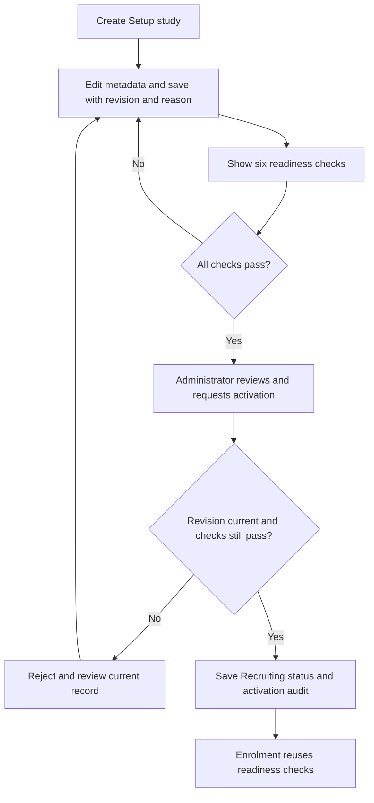
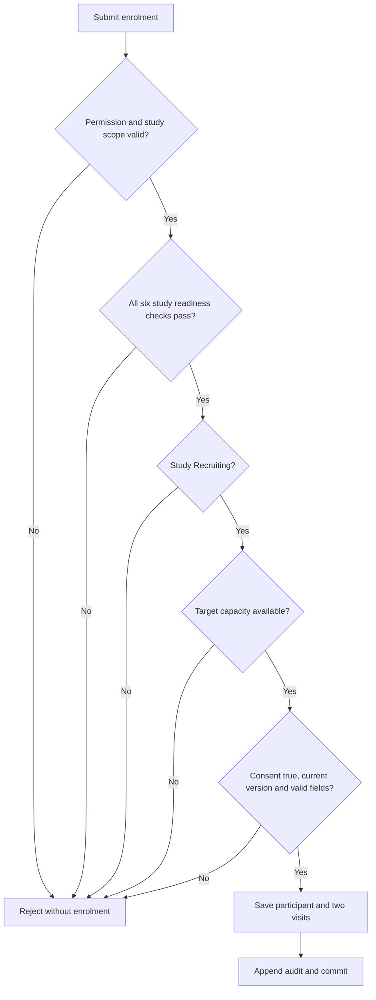
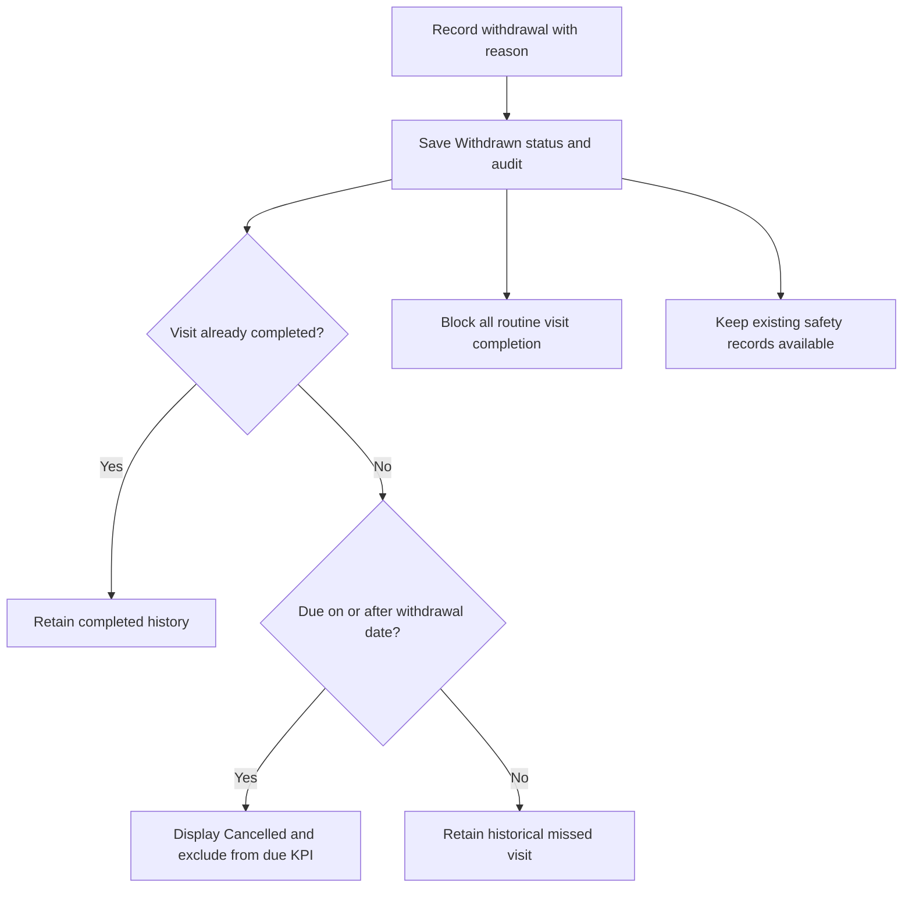
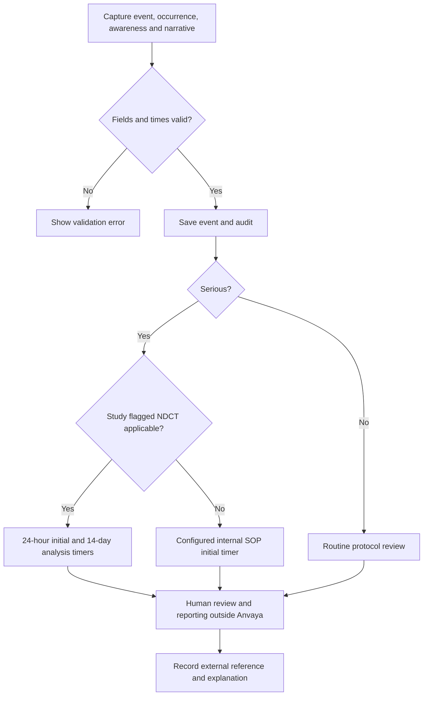

# Anvaya CTMS — User workflows and exception handling

Version: 1.1 · Updated: 30 September 2026 · Context: SIH problem statement 26046

## 1. Scope and reading guide

This document describes the working synthetic prototype and separates it from future institutional workflows. It is an implementation-aligned product specification, not an approved clinical SOP. Study-specific clinical, ethics and reporting responsibilities require institutional review.

The implementation consists of [server.py](../server.py), a persistent SQLite database and [public/app.js](../public/app.js). The browser polls the server every ten seconds while visible. It is a local demonstration, with no live CTRI, EDC, HIS, ABDM, email or regulator connection. The current interface is English. All study references, people, participant records and clinical events are fictional.

Use [USER_PERSONAS.md](USER_PERSONAS.md) for roles and visibility. The implementation's `ROLES` table is the source of current permissions. [REGULATORY_TRACEABILITY.csv](REGULATORY_TRACEABILITY.csv) maps the broader design to source requirements and remaining gaps.

Each workflow states its actors, preconditions, sequence, decisions, output and limitations. An “audit event” means a persisted application event; it does not mean an electronic signature, independent review or regulator acceptance. Normal record changes and their audit entries are committed together.

## 2. Shared operating rules

| Rule | Current behavior |
|---|---|
| Identity | Named accounts use individual credentials, mandatory initial password change and managed study assignments. Optional demo personas use `Demo#26046`; the shared mode can be disabled. |
| Session | Server creates an eight-hour in-memory session, an HttpOnly SameSite=Strict cookie and a request token. A server restart requires another login. |
| Authorisation | Server checks action permission and, where applicable, assigned study scope. Hiding a button is not the only control. |
| Persistence | SQLite retains study and operational records across normal server restarts. Sessions do not persist. |
| Input | Server validates required fields, allowed values, numeric limits and relevant timestamps. Invalid changes are rejected. |
| Study revisions | Setup saves and activation require the revision the administrator reviewed. A stale revision is rejected instead of overwriting newer data. |
| Time | Server stores timezone-aware timestamps. Browser datetime controls accept local time and convert it before submission. Date-based study and visit checks use the server's UTC date. |
| Audit | Mutations record stable account ID (or explicit demo role), action, record, time, study context, reason and applicable before/after values. Local credentials do not establish professional authority. |
| Refresh | Data is fetched about every ten seconds while the page is visible. Automatic redraw is deferred while the user edits a form or inspects expanded details. |
| Errors | A rejected form shows an error. The user must correct the cause and resubmit. There is no offline mutation queue or guaranteed automatic retry. |
| External action | A reference recorded in Anvaya describes an action carried out elsewhere. The application sends no clinical or regulatory report. |

## 3. WF01 — Sign in, inspect access and switch role

**Actors:** All eight implemented roles. **Trigger:** Open the local application or choose the switch-role action.

**Preconditions:** The Python server is running, the browser can reach it, and the user is working with the synthetic dataset.

1. Choose a demonstration role from the login page and enter the demo password.
2. The server validates the role and password. Repeated failed attempts are limited by client address within a short window.
3. On success, the server creates a session and appends `SESSION_STARTED` to Audit.
4. The browser requests the role profile and a scoped data snapshot, then opens Overview.
5. The user navigates to a page. Some pages show a role-restriction message; others show only permitted records or actions.
6. To switch persona, select the top-right switch-role button. The app terminates the current session and returns to login. Select a new role and sign in again.

**Decisions and exceptions.** Incorrect credentials return a specific error. An expired session requires login. A valid session without action permission receives a forbidden response. A valid action against a study outside the role's scope is also forbidden. Responses from an earlier role's pending refresh or audit request are discarded after the role changes.

**Outputs and audit.** A scoped workspace and a `SESSION_STARTED` entry result from successful login. There is no separately persisted logout event in the current implementation. Study-scoped audit viewers do not see global events that have no study identifier, including session and export events.

**Future extension.** Connect the working named-account model to institution-approved identity, MFA and access reviews. Add real delegation and identity evidence before treating recorded actors as attributable clinical users.

## 4. WF02 — Review portfolio and investigate an exception

**Actors:** All roles within their visible scope; leadership uses aggregate views. **Trigger:** Start of a working session or routine portfolio review.

**Preconditions:** Successful login and a returned data snapshot.

1. Open Overview and inspect study count, cumulative enrolment, due-visit completion and pending initial SAE reports.
2. Read the supporting text under each KPI. Recruitment totals are cumulative and still include withdrawn participants; they do not mean “currently receiving intervention.”
3. Inspect the cumulative enrolment chart and the Needs attention list.
4. Select a study or open Studies. Filter by study or study status and inspect its detail dialog.
5. Review the study's target, site, design, separate protocol and consent versions, registry reference, ethics dates and configured safety pathway. The readiness panel explains six checks and identifies blockers; the Studies summary counts Setup studies ready for activation.
6. Use the related operational screen to investigate an exception. Alert navigation opens the relevant page; it does not automatically select the alert's study filter.

**Decisions and exceptions.** Recruitment pace compares cumulative enrolment with a simple linear expected count over the configured study dates. It is an operational heuristic, not a recruitment forecast. “Attention” on a study reflects a failed readiness check, recruitment pace or ethics expiry; the separate alert list also contains other conditions. A role with no participant-level access cannot drill into individual participant arrays.

**KPI definitions.** Due-visit completion is completed due visits divided by all due visits, excluding incomplete visits cancelled because they were scheduled on or after withdrawal. Historical missed visits before withdrawal remain in the denominator. If there are no eligible due visits, the rate is unavailable. Pending initial SAE reports count serious events without a recorded initial-report step. Data-query counts include Open records only.

**Outputs and audit.** A current operational picture and a chosen follow-up action. Viewing or filtering ordinary pages does not create an audit event. Counts describe synthetic operational records; they provide no clinical efficacy evidence.

## 5. WF03 — Create, configure and activate a study

**Actor:** Administrator. **Trigger:** A new synthetic study needs to be configured and opened for recruitment.

**Preconditions:** The user has `study` permission. Only the administrator has this permission in the current role model. Setup and activation operate on recorded metadata; they do not grant ethics approval or authenticate external evidence.

1. Open Studies and choose New study. Enter title, research area, target enrolment, intervention design, site and formulation/regimen or observational scope.
2. Submit the form. The server validates the fields and a target integer from 1 to 10,000, generates an identifier, and creates a Setup record at revision 1. Protocol and current consent versions are separate fields, initially set to 1.0. Investigator/batch and registry/ethics evidence still need review.
3. Open the new study's details and inspect its readiness checklist. The dialog displays the current revision and the reason each check is passed or blocked.
4. Choose Edit study setup. Record the protocol version and independent current consent version, responsible investigator, formulation/regimen, formulation batch, study start/end, CTRI reference and registration date, and IEC reference, approval date and expiry.
5. Enter a reason for the update and choose Save setup. Missing investigator, batch or registry/ethics evidence may be saved while gathering the remaining information. Protocol version, consent version, formulation and study dates remain required. Dates must be valid `YYYY-MM-DD` values; study end cannot precede start, and IEC expiry cannot precede a recorded approval date.
6. The server checks permission, Setup status and the submitted revision before saving. It increments the revision, records the update time and appends `STUDY_SETUP_UPDATED` with the reason and before/after values. The browser fetches the updated snapshot and reopens study details.
7. Inspect all six checks below. Correct remaining blockers through Edit study setup. A complete saved draft remains in Setup until an explicit activation action is taken.
8. Once all checks pass, choose Activate recruitment. Review the displayed checklist, confirm the review checkbox and enter an activation reason.
9. Submit. The server rechecks permission, Setup status, revision, review confirmation and every readiness condition using the current server date. It changes the status to Recruiting, records activation time and role, increments the revision and appends `STUDY_ACTIVATED`.
10. Inspect the Recruiting study. Enrolment can now proceed subject to the same readiness checks, target capacity, valid participant fields and current consent. Newly created studies can be demonstrated end to end using the administrator role.

| Readiness check | Condition required to pass |
|---|---|
| Prospective registration | A recorded registration reference that is not a pending placeholder or `REF` application reference, plus a registration date no later than today |
| Current IEC approval | A recorded approval reference, an effective approval date no later than today, and an expiry date that is not earlier than approval or today |
| Protocol and consent versions | Both version fields contain recorded values; they do not have to be equal |
| Responsible investigator | An investigator name is recorded rather than missing or marked pending/unassigned |
| Intervention context | Formulation/regimen context is recorded; Compound formulation and Single-herb formulation studies also require a batch reference |
| Study period open | Today falls on or between the recorded study start and end dates |

**Decisions and exceptions.** An incomplete saved draft stays blocked. Future registration/approval dates or a study period that has not opened prevent activation even though valid dates can be saved. Changing only the protocol version does not change the current consent version. If another save occurs after the form opens, the stale revision is rejected; close the form, refresh and review the latest record before resubmitting. Non-admin requests, unchecked review confirmation and repeated activation are rejected. Rejected setup/activation attempts do not persist a change or an accepted-change audit event.

**Outputs and audit.** `STUDY_CREATED` records initial creation, `STUDY_SETUP_UPDATED` records each accepted setup save, and `STUDY_ACTIVATED` records the Setup → Recruiting transition. Revisions and before/after values preserve metadata history. This is record versioning, not an uploaded document-version repository.

**Existing-record compatibility.** An older active demo study without `iec_approved_at` retains its earlier reference/expiry gate; the UI explains that its approval date was not captured. The application does not invent or backfill an approval date. An older record without `consent_version` reads its previous protocol value as the compatibility default, and a missing revision is read as 0. Newly activated Setup studies require the explicit approval date and independent consent-version field. Existing operational records remain in place.

**Current boundary.** Recording an investigator name does not provision a login or establish delegated authority. Access management controls account assignments separately. Setup edits remain restricted to Setup; active studies use the implemented independent amendment workflow with approved documents. External registry authentication, formal site authorisation and validated electronic signatures remain institutional requirements. The administrator's activation confirms a recorded checklist within this demonstration; it does not replace a real institutional approval process.

**Future extension.** Validate the implemented document/amendment workflow against authentic institutional evidence, signature requirements, approved applicability, verified registry records and site authorisation. Keep those evidence and authority requirements distinct from the working metadata setup and activation flow.

## 6. WF04 — Document consent metadata and enrol a participant

**Actors:** Administrator, PI or coordinator, within assigned scope. **Trigger:** Staff need to record a synthetic adult's enrolment.

**Preconditions:** The study already exists, is open for recruitment and has the demo prerequisite metadata. The current form records an assertion that consent was documented outside the app; it is not the consent conversation or a signature ceremony.

1. Open Participants & consent and choose Enrol participant.
2. Select a study. Enter age, sex, Prakriti assessment and consent language. The form prefills the selected study's current consent version and updates it when the study selection changes; confirm that it matches the documented consent.
3. Confirm the checkbox that consent is documented using the current version.
4. Submit. The server checks role permission and study scope before continuing.
5. The server repeats WF03's six readiness checks, then checks Recruiting status and remaining target capacity. An earlier activation does not bypass readiness at the time of enrolment.
6. The server requires consent to be true and the submitted consent version to match the study's independent `consent_version`, rather than its protocol version. It accepts synthetic adult ages 18–100 and the documented field choices.
7. If all checks pass, create a participant identifier, consent metadata and enrolment timestamp. Create two follow-up visits, due 14 and 28 days after entry, and append the audit event in the same transaction.
8. Return to the participant list and inspect the participant, consent state and updated study count.

**Decisions and exceptions.** A failed readiness check, wrong consent version, absent consent, non-recruiting status or full target blocks the operation. For example, a study with protocol `P-3` and consent `ICF-2` accepts only `ICF-2` as the participant's consent version. The form remains open with the returned explanation. Rejected attempts do not create a participant or enrolment audit event. The demo checks stored metadata; it does not verify a registry reference against CTRI or inspect an approval document.

**Outputs and audit.** An Enrolled participant with active consent, the accepted consent version, two scheduled visits and `PARTICIPANT_ENROLLED`. Consent and enrolment timestamps reflect server entry time. Legacy studies without a separate consent-version field retain their earlier protocol-value fallback, as described in WF03.

**Implemented extension and remaining boundary.** Versioned document uploads, independent review, amendments and current-version reconsent are implemented in section 19. Uploaded files do not independently authenticate their issuer or participant signatures. Screening, protocol-specific eligibility, reviewed visit schedules, randomisation, allocation concealment, intervention assignment and eligibility adjudication remain outside this release. The prospective-registration gate is a conservative demo policy; real study categories need an approved applicability decision. The [CTRI FAQ](https://ctri.nic.in/Clinicaltrials/faq.php) explains prospective registration before enrolment and discusses different study categories.

## 7. WF05 — Record a due visit

**Actors:** Administrator, PI or coordinator within assigned scope. **Trigger:** A scheduled follow-up has occurred and staff need to record completion.

**Preconditions:** The participant has active consent, the visit is incomplete, and its scheduled date is today or earlier according to the server's UTC date.

1. Open Visit schedule and filter by study or status.
2. Select Record visit on an eligible row.
3. Enter the source-verification explanation or reason. Explain delayed entry where applicable.
4. Submit. The server rechecks permission, study scope, participant consent, existing completion state and scheduled date.
5. Save the completion timestamp and audit event. Refresh the schedule and due-visit KPI.

**Decisions and exceptions.** Future visits cannot be marked complete in this demo. A previously completed visit cannot be completed again. Routine visit completion after consent withdrawal is rejected, including a visit whose due date preceded withdrawal. Cancelled visits have no Record visit action.

**Outputs and audit.** The visit displays Completed and `VISIT_COMPLETED` records the reason and prior/current values. The completion timestamp is the time staff entered completion; a distinct actual visit date and late-entry review are future work.

**Current boundary.** No visit procedures, clinical measurements, missed-visit reasons, rescheduling, protocol windows or source-document attachments are collected. The two fixed follow-ups demonstrate scheduling and completion rather than implementing a study-specific electronic case report form.

## 8. WF06 — Record consent withdrawal and preserve history

**Actors:** Administrator, PI or coordinator within assigned scope. **Trigger:** A synthetic participant's withdrawal has been communicated and staff need to record it.

**Preconditions:** The participant exists and consent is currently active. Real withdrawal communication and its interpretation occur outside this prototype.

1. Find the participant in Participants & consent.
2. Choose Withdraw consent and read the notice that existing records are retained.
3. Enter the reason and context. Submit the action.
4. The server checks permission, scope and whether withdrawal has already been recorded.
5. Persist `consent=false`, status Withdrawn and the server withdrawal timestamp; append the audit event.
6. On subsequent snapshots, incomplete visits scheduled on or after the UTC withdrawal date are displayed as Cancelled. These visits are excluded from the due-visit completion denominator.
7. Completed visits retain their history. Incomplete visits due before the withdrawal date remain historical overdue records. The server blocks all further routine visit completion for the withdrawn participant.

**Decisions and exceptions.** A second withdrawal attempt is rejected. The same-day cancellation rule is a date-based demo convention, because visits have a due date rather than a time. Withdrawal does not delete the participant, erase audit history, reduce cumulative enrolment or suppress existing safety cases.

**Outputs and audit.** Updated participant state and `CONSENT_WITHDRAWN`. Visit cancellation is derived when data is read; separate persisted `VISIT_CANCELLED` events are not created. The underlying planned visit records remain available.

**Future extension.** Distinguish withdrawal from treatment, optional procedures, future contact and different data uses where the approved process requires it. Establish how safety follow-up, retained records, correction requests and privacy rights are handled. The MVP permits safety-event capture after withdrawal; an authorised human must determine the legitimate basis and protocol requirements in a real deployment. Reconsent is implemented for active participants after a consent-version change; it does not reinstate withdrawn participants.

## 9. WF07 — Capture an AE or SAE and determine its displayed timer

**Actors:** Administrator, PI, coordinator or PV officer within assigned scope. **Trigger:** Staff learn of an event concerning a study participant.

**Preconditions:** The participant already exists in the demo. The application supports documentation; clinical care and urgent escalation are external processes.

1. Open Safety & vigilance and choose Report adverse event.
2. Select the participant. The server derives the study from that participant rather than trusting a separately supplied study identifier.
3. Enter the verbatim event term and narrative. Select seriousness criterion independently from severity.
4. Enter occurrence time and first-awareness time using the local datetime controls. The browser converts them to timezone-aware timestamps.
5. Submit. The server checks access, supported values, valid timestamps, absence of material future times and awareness not preceding occurrence.
6. Persist the event as Awaiting review with a server receipt time. Coding remains Pending licensed dictionary review. No causality assessment is inferred.
7. Compute the timer from occurrence time using the study's configured pathway. Inspect the resulting record and exact dates.

| Event and study configuration | Initial timer in this MVP | Analysis timer in this MVP | Display meaning |
|---|---|---|---|
| Serious event; study flagged `ndct=true` | Occurrence + 24 hours | Occurrence + 14 days | Demonstration of the selected NDCT investigator reporting pathway; applicability is assumed in seeded metadata |
| Serious event; `ndct=false` | Occurrence + configured `safety_hours` | None | Internal protocol/SOP target; seeded value is 24 hours |
| Non-serious event | None | None | Routine review per protocol; no statutory countdown asserted |

The 24-hour internal SOP target is **not a universal legal rule for all Ayurveda studies**. The conditional NDCT branch is based on the project's mapped investigator reporting provisions, including Rule 42 and Rule 25(x). It does not implement every actor, recipient, injury/death branch or compensation procedure. The governing source and amendments must be reviewed for each study: [CDSCO NDCT rules](https://www.cdsco.gov.in/opencms/opencms/en/Acts-and-rules/New-Drugs/).

**Time semantics.** Occurrence is when the event happened. Awareness is when staff first learned of it. Server receipt is when it was entered. Late awareness does not restart the occurrence-based timer implemented here. A recently entered case may therefore already be overdue. Seed timestamps are created relative to the first database initialisation; they continue ageing as the app runs.

**Outputs and audit.** One safety event, derived deadlines and `SAFETY_RECORDED`. Pending deadlines within 24 hours generate visible dashboard alerts; overdue items remain visible until the corresponding step is recorded. This is an in-app alert mechanism, with no background email/SMS escalation.

**Current boundary.** The app stores the selected seriousness criterion and severity without adjudication. It can record a reviewer-selected code from an authorised supplied dictionary release and retains its version and history. No licensed terms are bundled; WHODrug is not used for AE coding. It does not assign causality, detect a validated safety signal, generate a complete ICSR or merge duplicate cases. No automatic treatment recommendation is produced.

## 10. WF08 — Record initial and analysed reporting steps

**Actors:** Administrator, PI or PV officer within assigned scope. **Trigger:** A reporting action has taken place outside Anvaya and its metadata needs to be recorded.

**Preconditions:** The safety case exists. The user has `report` permission. Recording a step is not evidence that Anvaya transmitted a report.

1. In the safety inbox, inspect the case, its pathway and the outstanding step.
2. Select Record initial, or Record analysis after an initial step has been recorded and the UI offers the analysis step.
3. Enter an external receipt/submission reference and a narrative explanation covering recipients, evidence and any delay.
4. Submit. The server checks permission, study scope and whether the selected phase is already recorded. Analysis cannot be recorded before initial reporting.
5. Persist the reference, server entry timestamp and corresponding status; append the before/after audit entry.
6. Refresh the inbox. The recorded step is no longer pending. For an applicable serious case, the other outstanding phase remains independently visible.

**Decisions and exceptions.** Empty references or reasons fail validation. A repeated phase is rejected. Coordinators can capture events but cannot record this reporting metadata. The UI offers the analysis action for cases with a computed analysis deadline; there is no complete recipient-specific reporting state machine.

**Outputs and audit.** Initial recording produces `SAFETY_INITIAL_RECORDED`; analysis recording produces `SAFETY_ANALYSIS_RECORDED`. Case status becomes Initial report recorded or Analysis recorded. Neither status is a regulator acknowledgement verified by the system.

**Current limitation that matters for presentations.** `reported_at` and `analysis_at` are the times the user recorded metadata in this app. They are not separately entered or verified external submission times. The UI shows that a step was recorded and does not provide a validated on-time reporting metric. A case recorded late can no longer be inferred to have been externally reported late or on time solely from these fields.

**Future extension.** Separate actual dispatch/submission time, system-entry time, delivery evidence and recipient acknowledgement. Add reviewable late-report explanations, recipient-specific status, rule versions, follow-up reports and escalation ownership. Preserve prior versions when correcting a report instead of overwriting them without history.

## 11. WF09 — Resolve an existing data query

**Actors:** Administrator, PI, coordinator or monitor within assigned scope. **Trigger:** An Open query has been investigated against its source.

**Preconditions:** A seeded query exists and is Open. Source-document review occurs outside the app.

1. Open Data quality and filter by study or status.
2. Read the field and review request. Query age is calculated from its opening timestamp.
3. A query at or beyond the configured age threshold displays Aging in the register.
4. Choose Resolve and enter the resolution/source-verification explanation.
5. Submit. The server checks role, scope, current Open state and required explanation.
6. Save Resolved status, explanation and resolution time. The open-query KPI decreases.

**Decisions and exceptions.** Already resolved queries cannot be resolved again. The ageing threshold labels queries in this register; it does not currently create a separate dashboard alert. A resolution does not edit the queried source field or prove that a source document was independently reviewed.

**Outputs and audit.** Updated query and `QUERY_RESOLVED`, with before/after values and explanation.

**Future extension.** Add query creation, assignment, response, independent review, reopening, controlled source correction and attachments. Define whether the same user may respond and close a query. There is no automated data-validation engine creating queries in this MVP.

## 12. WF10 — Review ethics and registry milestones; configure operational alerts

**Actors:** All roles may inspect their visible study milestones. Only the administrator can change alert thresholds. **Trigger:** Periodic readiness review or adjustment of operational warning horizons.

**Preconditions:** Study metadata exists. Registry and approval entries in the dataset are synthetic references.

1. Open Ethics & regulatory and review each study's registry reference/date, IEC approval status and expiry, independent protocol and consent versions, and readiness count. Open a study for the six-check detail and its safety pathway.
2. An administrator can edit a Setup study's evidence and activate it through WF03. Follow up on missing authentic registration or expiring approval through the real institutional process; saving a reference does not perform registry submission or ethics review.
3. As administrator, choose Alert thresholds.
4. Set recruitment alert threshold as a percentage of expected pace, IEC warning horizon in days and the open-query ageing threshold.
5. Submit. The server validates integer ranges: recruitment 1–100%, IEC 1–180 days and query age 1–90 days.
6. Refresh the relevant pages to see recalculated attention states and labels.

**Decisions and exceptions.** Other roles cannot change settings. Recruitment alerts apply to Recruiting studies. Ethics expiry is date-based. The settings form cannot alter a study's legal applicability flag, initial SAE clock or analysed-report clock.

**Outputs and audit.** Updated operational settings and `ALERT_SETTINGS_UPDATED`. Setup evidence changes and activation use their separate WF03 audit events. Reading milestones does not create an audit event. The current system does not schedule reminders for CTRI updates, create approval-renewal tasks or upload approval documents; the saved evidence consists of references, dates and version metadata.

**Future extension.** Introduce a formal regulatory applicability review, verified registry evidence, versioned approval documents and renewal ownership. The implemented document review and active-study amendment flow supplies local evidence history; authentic issuer verification remains necessary. Separate approval validity from uploaded-document presence and formal review outcome.

## 13. WF11 — Export scoped research records

**Actors:** Administrator, PI, monitor or regulator. **Trigger:** A reviewer needs a downloadable structured representation of visible records.

**Preconditions:** Authenticated session with `export` permission. PI and monitor remain restricted to assigned studies.

1. Open Data exchange and read the format description.
2. Choose FHIR JSON, DM mapping preview or AE mapping preview.
3. The server checks permission and constructs the export using scoped records.
4. The server appends `DATA_EXPORTED` and returns a downloadable file.
5. The browser downloads the file and displays confirmation.

| Output | Current contents | Boundary |
|---|---|---|
| FHIR R4 research collection Bundle | ResearchStudy, Patient, ResearchSubject and Consent resources, linked with synthetic identifiers | Core research export; no ABDM clinical DocumentBundle, live exchange or formal conformance certification |
| DM CSV mapping preview | Study/participant/site identifiers, age, sex and consent timestamp | A selected demographic mapping; no complete SDTM package |
| AE CSV mapping preview | Study/participant identifiers, event sequence, verbatim term, severity, seriousness and occurrence | No licensed coded terms, complete AE domain, ADaM analysis or Define-XML |

**Decisions and exceptions.** Unsupported formats are rejected. CSV text that resembles a spreadsheet formula is neutralised. The FHIR endpoint supports an optional study parameter; the current UI downloads all records within the role's scope. CSV exports also cover all assigned studies. Page filters are not export filters.

**Outputs and audit.** A file and a `DATA_EXPORTED` event identifying the format and role. The event does not contain a file hash or prove that the browser retained the download. For scoped PI/monitor viewers, that global export event is not included in the study-filtered audit response.

**Implemented extension and remaining boundary.** CSV intake has reviewed mappings and provenance; terminology review preserves dictionary versions. Exports enforce account study scope. The [official base-R4 validation](FHIR_VALIDATION.md) records zero errors with unresolved consent-policy warnings and disabled terminology checks. Complete export manifests, partner delivery and profile/terminology acceptance remain additional work. Full SDTM, ADaM and Define-XML packages need separate data standards and statistical-analysis work. Core FHIR and ABDM conformance are distinct: see the [HL7 FHIR R4 specification](https://hl7.org/fhir/R4/) and [NRCeS ABDM implementation guide](https://nrces.in/ndhm/fhir/r4/).

## 14. WF12 — Inspect changes and verify the audit chain

**Actors:** Administrator, PI, monitor, ethics reviewer or regulator. **Trigger:** Review a change, investigate a record or demonstrate application integrity controls.

**Preconditions:** The role has `audit` permission. PI and monitor receive only events linked to assigned studies.

1. Open Audit trail. The server returns visible events in reverse sequence order and the result of checking the stored chain.
2. Filter by study or search for an entity, action or explanation.
3. Expand an entry to inspect its prior and current values.
4. Choose Verify chain to perform the check again.
5. Inspect whether each event's recorded previous hash matches the preceding event and whether the payload reproduces the stored hash.

**Decisions and exceptions.** A verification failure is displayed as a failure; the app does not silently repair or rewrite the ledger. The verification count covers the full stored chain, while a scoped viewer's displayed rows may cover only a subset. The role may therefore see fewer rows than the verified count.

**Outputs and audit.** A verification result and inspectable history. Reading or verifying the chain does not itself append an event. SQLite triggers reject normal SQL updates and deletes of audit rows; application code appends new entries.

**Current boundary.** Local hash linkage and database triggers demonstrate tamper evidence within this application. They do not establish independent immutability against an administrator who can replace the database, remove triggers or alter the application. Named local accounts and verified backup/restore now work. Independent identity assurance, separately retained checkpoints, encrypted storage and operated backup schedules remain institutional requirements. Do not present the demo as certified ALCOA+ or GCP compliance.

## 15. WF13 — Handle validation, disconnection and uncertain completion

**Actors:** Any permitted operator. **Trigger:** A form fails, the network disconnects or a response is interrupted.

1. Read the form error. Correct a validation issue such as missing consent or an invalid timestamp before retrying.
2. If the connection fails, the app may retain its last fetched data and show a connection banner. The visible records are not evidence of a fresh server response.
3. Restore the connection and refresh the relevant list before repeating a submission whose outcome is uncertain.
4. Inspect the expected record and, where authorised, its audit event.
5. Repeat only after determining whether the first operation was recorded. Report unexplained behavior for investigation instead of inventing a clinical correction.

**Current boundary.** The prototype has no client-generated idempotency key for enrolment, new study or safety creation. A response lost after a committed write can leave the browser uncertain; blindly resubmitting could create another record. Duplicate phase recording, withdrawal, query resolution and visit completion do have state guards, but these are not a general retry mechanism.

**Future extension.** Add request identifiers, reconciliation of uncertain submissions, validated correction workflows and an operational incident process. Offline clinical capture requires a separate design for protected local storage, identity, synchronisation and conflict resolution.

## 16. Additional institutional workflows and acceptance

| Workflow | Proposed sequence | Required evidence before implementation is considered complete |
|---|---|---|
| Authentic approvals and site authorisation | Extend implemented document review and amendments with authenticated issuers → formal applicability review → verified registry evidence → site authorisation | Verified external records, signature evidence and institutional delegation; local document review and controlled amendments already work |
| Screening and randomisation | Screening record → protocol eligibility review → approved consent → eligible enrolment → controlled allocation if applicable | Approved eligibility rules, allocation concealment, restricted access and a validated randomisation method |
| Participant-facing reconsent | Extend implemented amendment-triggered reconsent and history with participant information delivery and signature evidence | Approved consent process, understanding/capacity checks, validated signatures and study-specific refusal handling |
| Protocol deviations and monitoring | Detect issue → classify → assign → investigate → corrective action → review closure | Approved deviation taxonomy, source evidence, delegated ownership and traceable closure |
| Clinical forms and Ayurveda detail | Protocol CRFs → visit capture → validation → source review → locked data | Validated instruments, formulation/batch provenance, procedure details and study-specific outcome definitions |
| Licensed clinical coding and verified dispatch | Extend supplied-term review and recorded recipient follow-up with authorised dictionaries → actual transmission → independently verified acknowledgement | Verified licensing, clinical coding validation, reviewed causality, delivery evidence and complete actor-specific rules |
| DSMB review | Reviewed package → controlled blinded/unblinded access → meeting review → recommendation → authorised communication | Study charter, independence, report cutoff/version and documented recommendation |
| EDC/HIS/ABDM exchange | Authorised request → identity/consent checks → partner-profile mapping → validation → exchange → reconciliation | Partner agreements, semantic mappings, sandbox proof and profile-specific validation |
| Submission datasets | Reviewed source → SDTM mapping → analysis-ready derivation → Define-XML → validation → approved package | Controlled terminology, statistical plan, reproducible derivations and submission checks |
| Privacy requests and retention | Verified request → determine applicable obligation → authorised action → response → evidence retention | Approved notice, role ownership, retention rules and documented handling of exceptions |
| Close-out and archive | Resolve obligations → reconcile data → approved lock → final reporting → controlled archive | Outstanding-task checks, authorised lock, retention schedule and restoration proof |

## 17. Demonstration path and truthful presentation language

A coherent demonstration starts as administrator with the portfolio, then creates a study and inspects its readiness blockers. Save its setup metadata using different protocol and consent versions, review the six checks and activate recruitment. Enrol one synthetic participant into that study, inspect the accepted consent version and generated visits, and capture a synthetic safety event. Use the seeded NDCT-flagged study to contrast its timer with the new study's internal SOP timer. Record an external reporting reference while explicitly stating that nothing is sent. Resolve a query, withdraw consent, inspect cancelled future visits, verify Audit and download an export. Switch to leadership or monitor to demonstrate their visibility and permissions; recording an investigator name does not change account assignments, which administrators manage separately.

Use “versioned study setup and checked activation,” “independent protocol and consent versions,” “working consent metadata and enrolment gates,” “conditional safety timeline tracking,” “scoped server access,” “persistent records,” “hash-linked audit demonstration” and “FHIR/CSV export previews.” Avoid claiming a production cloud deployment, real regulatory submissions, licensed dictionary coding, validated e-signatures, randomisation, full ABDM integration or submission-ready SDTM/ADaM/Define-XML. Those are future workflows with explicit completion criteria above.

## 19. Additional connected workflows — implemented 30 September 2026

The complete screen-by-screen rehearsal is in [WEBSITE_UPGRADE_STEPS.md](WEBSITE_UPGRADE_STEPS.md). These flows extend the original operating paths above.

### Named access and session lifecycle

Administrator creates an account and assigns studies. The user signs in, replaces the temporary password, then receives a portfolio derived from that account's assignments. The server revalidates active state and authentication version on every request. Password reset, access change, disable and explicit revocation invalidate older sessions. GET authorisation and scoped reads share the application lock so a revocation cannot commit between the permission check and record retrieval. A restart logs users out without deleting accounts or records.

### Evidence and amendments

A named uploader selects study, Protocol/Consent/IEC kind, version and a PDF/text file. Basic type/size checks precede storage; metadata and SHA-256 appear in the register. A different named reviewer approves or rejects with a reason. Each version remains in history. An author submits an amendment that references three approved, correctly typed, same-study documents, approval dates, target and reason. Independent approval rechecks the study revision and readiness inside the transaction, applies the change and marks active consenting participants for reconsent when needed. Prior consent remains unchanged until the replacement consent event; then it moves into consent history. Withdrawal remains irreversible through the reconsent endpoint.

### Reviewed synthetic source intake

A permitted user previews up to 100 mapped CSV rows. Source hash, explicit mapping and row findings are saved without enrolment. Invalid batches cannot commit. Human review and a reason precede a transaction that invokes ordinary enrolment for each new source identity. The same source/study/external ID and row hash returns the prior result; changed content is a conflict. A later row failure rolls back earlier participants, visits and audit events in the batch. Provenance is downloadable separately. This route creates new workspace enrolments; it does not silently merge historical clinical records.

### Terminology suggestion and confirmation

A named administrator supplies an immutable dictionary package with type, release, code/label pairs and provenance. Non-synthetic packages require declared use rights; the declaration is not independent verification. The safety user requests lexical candidates for the verbatim event term. Up to five candidates above the lexical threshold appear, or the system abstains. Only a named reporting reviewer can confirm a code from the selected release. The original term/narrative remain unchanged and previous coding decisions remain in history. No trained NLP model, diagnosis or causality determination runs. The [research gap analysis](PRODUCTION_GAP_ANALYSIS.md) defines an evaluation path for a future NLP reranker.

### Recipient evidence

A reporting user records a recipient, phase, eligible named assignee, explicit deadline and rule/SOP reason. This does not itself establish statutory applicability. Follow-up moves from Awaiting dispatch to Awaiting receipt to Acknowledged. Actual external times, references, recorder and metadata-entry times remain distinct. Invalid chronology and repeat dispatch/receipt are rejected. Pending items can record escalation evidence and show overdue status. These actions send no report or message.

### Serving and recovery

The same request/domain handlers run under local HTTP or Waitress WSGI. Docker/Compose supplies a deployment configuration with an HTTPS proxy and persistent volume. A health read detects database availability; an operator must connect it to monitoring. Online backup includes committed WAL records and verifies database integrity/audit linkage. Restore always creates a new file, leaving application switchover explicit. See [DEPLOYMENT.md](DEPLOYMENT.md).
